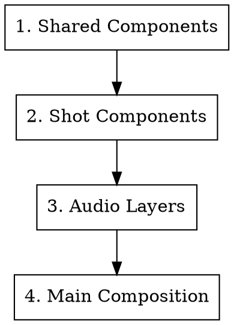

# Shot Compositor

Implements storyboard as Remotion React components. This is the core implementation phase where planning documents become working code.

**For additional Remotion API patterns, see `carocut-builder-remotion-ref` skill.**

---

## Incremental Mode

When receiving amendment instructions rather than building from scratch:

- **Modify specific shots:** Edit only the targeted shot component files. Do not regenerate unaffected shots.
- **Add new shots:** Create new `Shot{NNN}_*.tsx` files. Update the chapter index and main Composition to include them. Adjust `from` offsets for all subsequent shots in the same chapter.
- **Update frame timing:** When VO durations change, recalculate affected shot durations and propagate changes through all Duration Sync Points (see below).

---

## Implementation Order

Must follow this sequence to avoid dependency issues:



1. **Shared Components** - FlatDecorations, Card, DataTable, BarChart
2. **Shot Components** - Chapter-by-chapter implementation
3. **Audio Layers** - VoiceoverLayer, BackgroundMusicLayer, SfxLayer
4. **Main Composition** - Assembly with TransitionSeries

---

## Primitives 组件库

template-project 预置了 `src/primitives/` 组件库，提供电影级的视觉原子能力。
**所有 shot 实现必须优先使用 primitives 组件，禁止从零实现已有 primitive 覆盖的功能。**

### 导入

```tsx
import {
  KenBurns,
  AnimatedText,
  AnimatedChart,
  Transition,
  BreathingSpace,
  SplitScreen,
  DynamicBackground,
  MaskReveal,
  VideoClip,
} from '../primitives';
```

### KenBurns - 静态图片运镜

为静态图片添加电影级运镜效果，避免画面呆板。

**关键 Props:**

| Prop | Type | 说明 |
|------|------|------|
| src | string | 图片路径（staticFile） |
| effect | string | 运镜预设，共 10 种 + custom |
| scaleFrom | number | 起始缩放比例 |
| scaleTo | number | 结束缩放比例 |
| objectFit | string | 图片填充方式 |

**effect 可选值:** `zoom-in`, `zoom-out`, `pan-left`, `pan-right`, `pan-up`, `pan-down`, `zoom-in-top-left`, `zoom-in-top-right`, `zoom-in-bottom-left`, `zoom-in-bottom-right`, `custom`

**Storyboard 映射:** `camera_movement` → `effect`（`static` 时不使用 KenBurns）

```tsx
<Sequence from={startFrame} durationInFrames={duration}>
  <KenBurns src={IMAGES.hero} effect="zoom-in" />
</Sequence>
```

### AnimatedText - 文字动画

6 种动画模式，覆盖标题、正文、数据等文字出场需求。

**模式与关键 Props:**

| mode | 关键 Props | 用途 |
|------|-----------|------|
| typewriter | text, speed | 逐字打字效果 |
| fade-up | text, unit("char"\|"word"\|"line") | 从下方淡入 |
| fade-down | text, unit | 从上方淡入 |
| spring-in | text, unit | 弹性出现 |
| highlight | text, highlights, highlightColor | 关键词高亮 |
| counter | from, to, suffix, prefix | 数字滚动计数 |

```tsx
// 标题弹性出现
<AnimatedText mode="spring-in" text="核心发现" unit="char" style={{ fontSize: 72, fontWeight: 700 }} />

// 数字计数
<AnimatedText mode="counter" from={0} to={2136} suffix="个" style={{ fontSize: 96 }} />

// 关键词高亮
<AnimatedText mode="highlight" text="这是一个重要的发现" highlights={["重要"]} highlightColor="#FBBF24" />
```

### AnimatedChart - 数据动画

数据可视化动画组件，替代静态 Recharts 图表。

**关键 Props:**

| Prop | Type | 说明 |
|------|------|------|
| type | "bar" \| "horizontal-bar" \| "progress-ring" | 图表类型 |
| data | { label, value, color }[] | 数据数组 |
| stagger | number | 各数据项动画间隔（秒） |

```tsx
<AnimatedChart
  type="horizontal-bar"
  data={[
    { label: "React", value: 85, color: "#61DAFB" },
    { label: "Vue", value: 60, color: "#4FC08D" },
  ]}
  stagger={0.1}
/>
```

### Transition - 转场效果

7 种转场效果，用于 shot 之间的视觉过渡。

**关键 Props:**

| Prop | Type | 说明 |
|------|------|------|
| type | string | 转场类型，共 7 种 |
| direction | "in" \| "out" | 入场或离场 |
| durationSec | number | 转场持续时间（秒） |

**type 可选值:** `circle-wipe`, `diagonal-wipe`, `iris`, `curtain`, `blinds`, `zoom-fade`, `dissolve-blur`

**Storyboard 映射:** `transition_in.type` → `type`，`transition_in.duration_ms` → `durationSec`

```tsx
<Transition type="circle-wipe" durationSec={0.8}>
  <ShotContent />
</Transition>
```

### BreathingSpace - 呼吸段

用于章节间的视觉休息，让观众消化信息。

**关键 Props:**

| Prop | Type | 说明 |
|------|------|------|
| variant | string | 呼吸段样式，共 5 种 |
| color | string | 前景色 |
| backgroundColor | string | 背景色 |
| text | string | 可叠加的章节标题文字 |
| textStyle | CSSProperties | 文字样式 |

**variant 可选值:** `gradient`, `fade-black`, `fade-white`, `particles`, `radial-pulse`

**Storyboard 映射:** `breathing=true` 时整个 shot 使用 BreathingSpace

```tsx
<BreathingSpace
  variant="particles"
  color="#ffffff"
  backgroundColor="#0a0a0a"
  text="第二章"
  textStyle={{ fontSize: 48, fontWeight: 300, color: '#ffffff' }}
/>
```

### SplitScreen - 分屏

同时展示两个内容区域，用于对比、前后对照等场景。

**关键 Props:**

| Prop | Type | 说明 |
|------|------|------|
| layout | "horizontal" \| "vertical" \| "pip" | 分屏布局方式 |
| left / right | ReactNode | 左右内容（horizontal/vertical 布局） |
| leftLabel / rightLabel | string | 分屏标签 |

```tsx
<SplitScreen
  layout="horizontal"
  left={<KenBurns src={IMAGES.before} effect="zoom-in" />}
  right={<KenBurns src={IMAGES.after} effect="zoom-in" />}
  leftLabel="2007"
  rightLabel="2024"
/>
```

### DynamicBackground - 动态背景

为 shot 提供动态背景层，增加视觉丰富度和电影感。

**关键 Props:**

| Prop | Type | 说明 |
|------|------|------|
| variant | string | 背景样式，共 6 种 |
| colors | string[] | 渐变颜色数组 |
| intensity | number | 效果强度（用于 vignette） |

**variant 可选值:** `flowing-gradient`, `mesh-gradient`, `grid`, `dots`, `vignette`, `aurora`

**关键:** `vignette` 可叠加在任何内容上方增加电影感暗角效果。

```tsx
// 作为 shot 背景
<DynamicBackground variant="mesh-gradient" colors={COLORS.gradient}>
  {/* shot 内容放在 children 中 */}
  <div style={{ padding: 80 }}>
    <AnimatedText mode="fade-up" text="标题" />
  </div>
</DynamicBackground>

// 叠加暗角
<DynamicBackground variant="vignette" intensity={0.5} />
```

### MaskReveal - 遮罩揭示

通过遮罩动画揭示内容，适合重点内容的戏剧性呈现。

**关键 Props:**

| Prop | Type | 说明 |
|------|------|------|
| shape | string | 遮罩形状，共 10 种 |
| durationSec | number | 揭示动画时长（秒） |

**shape 可选值:** `circle`, `ellipse`, `rectangle`, `diamond`, `wipe-left`, `wipe-right`, `wipe-up`, `wipe-down`, `split-horizontal`, `split-vertical`

```tsx
<MaskReveal shape="circle" durationSec={1.0}>
  
</MaskReveal>
```

### VideoClip - 视频嵌入

嵌入视频片段，支持裁剪、变速、音量控制和淡入淡出。

**关键 Props:**

| Prop | Type | 说明 |
|------|------|------|
| src | string | 视频文件路径 |
| playbackRate | number | 播放速率 |
| volume | number | 音量（0-1） |
| muted | boolean | 是否静音 |
| startFromSec | number | 视频起始秒数 |
| endAtSec | number | 视频结束秒数 |
| fadeInSec | number | 淡入时长（秒） |
| fadeOutSec | number | 淡出时长（秒） |
| objectFit | string | 视频填充方式 |
| overlay | string | 叠加颜色层 |

```tsx
<VideoClip
  src={VIDEO.demo_recording}
  fadeInSec={0.5}
  fadeOutSec={0.5}
  playbackRate={1.5}
  volume={0}
  overlay="rgba(0,0,0,0.2)"
/>
```

### Storyboard → 组件映射规则

| storyboard 字段 | 组件/属性 | 说明 |
|----------------|----------|------|
| camera_movement | KenBurns.effect | static 时不使用 KenBurns，其他值直接映射 |
| framing | 构图尺寸和元素比例 | ECU=主体占满画面, LS=主体占画面 1/3 |
| pacing | 动画 duration 和 stagger | slow=长时值+慢stagger, fast=短时值+快stagger |
| visual_tension | spring.damping 和动画幅度 | 低张力=高damping(柔和), 高张力=低damping(弹跳) |
| transition_in.type | Transition.type | 直接映射 |
| breathing=true | BreathingSpace | 整个 shot 使用 BreathingSpace |
| audio_visual_relation | Audio Sequence.from 偏移 | lead-visual: 画面提前; lead-audio: 音频提前 |

### 电影感强制规则（MANDATORY）

1. **禁止静态图片**：所有 `` 必须包裹在 `<KenBurns>` 中（除非图片是 UI 元素如图标）
2. **禁止静态文字**：所有首次出现的文字必须使用 `<AnimatedText>`（已显示的文字可以保持静态）
3. **禁止静态图表**：数据展示必须使用 `<AnimatedChart>`，禁止静态 Recharts
4. **必须有动态背景**：每个 shot 的底层必须使用 `<DynamicBackground>`（任意 variant）
5. **暗角规则**：在非纯白背景的 shot 上叠加 `<DynamicBackground variant="vignette" intensity={0.4} />`。高张力 shot (visual_tension ≥ 0.7) 强烈建议使用。纯白背景除外。
6. **呼吸段必须实现**：storyboard 中 breathing=true 的 shot 必须使用 `<BreathingSpace>`
7. **呼吸段音频处理**：breathing shot 期间，BGM 应通过 `interpolate` 淡出到 volume 0.05；下一个 shot 开始时 BGM 淡入恢复。不播放旁白。

---

## Critical Rules

### Frame Calculation (MANDATORY)

**All frame values must be integers.** Floating-point values cause animation jitter or crashes.

```typescript
// CORRECT - always use Math.round()
const startFrame = Math.round(delaySec * fps);
const startFrame = secToFrames(delaySec);  // from timing.ts

// WRONG - produces float
const startFrame = delaySec * fps;  // 0.3 * 30 = 8.999...
```

### interpolate Safety (MANDATORY)

The `inputRange` array must be strictly monotonically increasing. Equal values crash.

**Error message:**
```
inputRange must be strictly monotonically increasing but got [27, 27]
```

**Cause:** Zero-length content producing zero duration:

```typescript
// DANGEROUS - empty text causes zero duration
const typingDuration = secToFrames(line.text.length * 0.02);  // = 0 if text.length = 0
interpolate(frame, [start, start + typingDuration], ...);  // [27, 27] CRASH
```

**Solution:**

```typescript
// SAFE - guarantee minimum 1-frame duration
const typingDuration = Math.max(secToFrames(line.text.length * 0.02), 1);

// Alternative: skip interpolation for zero-length content
const charsVisible = line.text.length === 0
  ? 0
  : Math.floor(interpolate(frame, [start, end], [0, line.text.length], {
      extrapolateLeft: "clamp",
      extrapolateRight: "clamp",
    }));
```

**Rule:** Any dynamic calculation that feeds into interpolate must be wrapped in `Math.max(..., 1)`.

### extrapolate Clamp (MANDATORY)

Always add clamp to prevent values outside range:

```typescript
interpolate(frame, [startFrame, endFrame], [0, 1], {
  extrapolateLeft: "clamp",
  extrapolateRight: "clamp",
});
```

---

## 1080p Visual Standards

### Font Size Guidelines

Video viewing distance requires larger fonts than desktop UI.

| Element | Font Size | Example |
|---------|-----------|---------|
| Main title | 72-84px | Cover title, chapter headers |
| Subtitle | 48-56px | Card titles, section headers |
| Body text | 24-28px | Paragraphs, descriptions |
| Table content | 20-24px | Data cells |
| Annotation | 16-20px | Badges, footnotes |
| Code | 18-22px | Monospace blocks |

**Audit command:**
```bash
grep -rn "fontSize:" src/ --include="*.tsx" | grep -E "fontSize:\s*[0-9]{1,2}[^0-9]"
```

### Text Color Contrast

On light backgrounds, use dark text. Light text on light backgrounds becomes unreadable after video compression.

```typescript
// Text color hierarchy
export const COLORS = {
  textDark: "#020617",      // Titles, emphasis (near black)
  textPrimary: "#0F172A",   // Body text (dark blue-black)
  textSecondary: "#334155", // Secondary info (dark gray)
  // NEVER use lighter colors on white/light backgrounds
};
```

**Rule:** On `flatGray`, `flatBlue`, white backgrounds, use only `textDark` or `textPrimary`.

---

## Background Layer Architecture

> **优先使用 `<DynamicBackground>`**：新 shot 应使用 primitives 组件库中的 `DynamicBackground` 替代手动组合背景层。仅在 DynamicBackground 不满足需求时使用下面的手动方式。

### 推荐方式（使用 DynamicBackground）

```tsx
<AbsoluteFill>
  <DynamicBackground variant="mesh-gradient" colors={COLORS.gradient}>
    {/* Content */}
    {children}
  </DynamicBackground>
  <DynamicBackground variant="vignette" intensity={0.4} />
</AbsoluteFill>
```

### 手动方式 Layer Stack (bottom to top)

```tsx
<AbsoluteFill>
  <GradientBackground />                    {/* 1. Gradient base */}
  <GridDots style={{ opacity: 0.2 }} />     {/* 2. Texture layer */}
  <GaussianBlobs style={{ opacity: 0.3 }} /> {/* 3. Optional: depth */}

  {/* Content layers */}
  <div style={{ position: 'relative', zIndex: 1 }}>
    {children}
  </div>
</AbsoluteFill>
```

### Available Decorations

| Component | Purpose | Opacity Range |
|-----------|---------|---------------|
| `GradientBackground` | Soft gradient base | 1.0 |
| `GridDots` | Grid texture | 0.15-0.3 |
| `GaussianBlobs` | Floating color blobs | 0.2-0.4 |
| `FloatingCircles` | Animated circles | 0.3-0.5 |
| `TechGridBackground` | Technical aesthetic | 0.2-0.3 |
| `BezierCurveDecoration` | Flowing curves | 0.4-0.6 |

**Principle:** Background opacity should never compete with content readability.

---

## Shot Duration Management

### Shots Without Voiceover

Shots without voiceover need explicit duration. Do not use default values.

| Shot Type | Minimum Duration | Rationale |
|-----------|------------------|-----------|
| Image display | 4-5 seconds | Viewer comprehension |
| Code (10 lines or less) | 6-8 seconds | Reading time |
| Code (more than 10 lines) | 8-12 seconds | Complex content |
| QR code / CTA | 6-7 seconds | Action time |
| Data table | 5-8 seconds | Analysis time |
| Chart animation | 4-6 seconds | Animation + comprehension |

### Voiceover-Based Duration

```typescript
function calculateShotDuration(voIds: string[], bufferMs = 700): number {
  const totalVoMs = voIds.reduce((sum, id) => sum + (VO_DURATIONS[id] || 0), 0);
  return msToFrames(totalVoMs + bufferMs);
}

// Example
const shotDuration = calculateShotDuration(['VO_005', 'VO_006', 'VO_007']);
```

### Duration Sync Points

When modifying shot durations, update ALL of these:

1. `SHOT_DURATIONS` constant (or equivalent timing config)
2. `<Sequence from={} durationInFrames={}>` for the shot
3. `<Sequence from={}>` for ALL subsequent shots in same chapter
4. Chapter duration exports (`CHAPTER1_DURATION`, etc.)
5. Root composition `durationInFrames`

---

## Animation Timing

### Staggered Entry Pattern

Elements should enter sequentially, not simultaneously:

```typescript
{items.map((item, index) => {
  const delay = 0.5 + index * 0.12;  // 0.12s between each
  const opacity = interpolate(
    frame,
    [secToFrames(delay), secToFrames(delay + 0.3)],
    [0, 1],
    { extrapolateLeft: "clamp", extrapolateRight: "clamp" }
  );
  const translateY = interpolate(
    frame,
    [secToFrames(delay), secToFrames(delay + 0.3)],
    [20, 0],
    { extrapolateLeft: "clamp", extrapolateRight: "clamp" }
  );

  return (
    <div key={index} style={{ opacity, transform: `translateY(${translateY}px)` }}>
      {item}
    </div>
  );
})}
```

### Common Animation Combinations

| Effect | Properties |
|--------|------------|
| Fade in + rise | `opacity: 0->1`, `translateY: 20->0` |
| Fade in + scale | `opacity: 0->1`, `scale: 0.95->1` |
| Slide from left | `translateX: -30->0` |
| Pop in | `scale: 0->1.05->1` (spring) |

### Easing Functions

```typescript
import { Easing, spring } from 'remotion';

// Smooth deceleration
const progress = interpolate(frame, [0, 30], [0, 1], {
  easing: Easing.out(Easing.cubic),
});

// Spring animation
const { fps } = useVideoConfig();
const springProgress = spring({
  frame,
  fps,
  config: { damping: 12, stiffness: 100 },
});
```

---

## Audio Architecture

### Three-Layer Model

```
+-------------------------------------+
|  SFX Layer (transitions, accents)   |  Volume: 0.3-0.5
+-------------------------------------+
|  VO Layer (voiceover)               |  Volume: 1.0
+-------------------------------------+
|  BGM Layer (background music)       |  Volume: 0.1-0.2
+-------------------------------------+
```

### Audio Positioning

**Use absolute frame calculation, not nesting:**

```typescript
// CORRECT - Absolute positioning
const voStartFrame = computeShotStartFrame('shot_005') + msToFrames(200);

// WRONG - Nested positioning (fragile, breaks on refactor)
<Sequence from={shotStart}>
  <Sequence from={200}>
    <Audio ... />
  </Sequence>
</Sequence>
```

### BGM Volume Fading

```typescript
const bgmVolume = interpolate(
  frame,
  [0, secToFrames(2), totalFrames - secToFrames(3), totalFrames],
  [0, 0.15, 0.15, 0],
  { extrapolateLeft: "clamp", extrapolateRight: "clamp" }
);
```

---

## Static Assets

### staticFile() Usage

```typescript
import { staticFile, Img, Audio } from 'remotion';
import { KenBurns } from '../primitives';

// Images - 优先使用 KenBurns 包裹（电影感强制规则）
<KenBurns src={staticFile("images/diagram.png")} effect="zoom-in" />

// 仅 UI 图标等小元素可直接使用 Img


// Audio - use Remotion's Audio component
<Audio src={staticFile("audio/vo/VO_001.wav")} />

// NOT native HTML elements
//   // WRONG
// <audio src="/audio/vo/VO_001.wav" />  // WRONG
```

**Why:** Remotion needs to track asset loading state for accurate frame rendering.

### Path Resolution

```
staticFile("audio/vo/VO_001.wav")
-> public/audio/vo/VO_001.wav
```

Paths are relative to `public/` directory. Case-sensitive.

---

## Sprite Sheet Animation

### SpriteSheet Component Pattern

Use this pattern to render sprite sheet animations in Remotion. The component slices a single sprite sheet image into individual frames using CSS `background-position`.

```tsx
import { useCurrentFrame, useVideoConfig, staticFile, Img } from "remotion";

interface SpriteSheetProps {
  /** Path relative to public/ (e.g. "images/robot_sprite.png") */
  src: string;
  /** Number of columns in the sprite grid */
  cols: number;
  /** Number of rows in the sprite grid */
  rows: number;
  /** Which row to animate (0-indexed) */
  row: number;
  /** Number of frames in this animation row */
  frameCount: number;
  /** Playback rate: frames per second for the sprite animation */
  spriteFrameRate?: number;
  /** Display width in pixels */
  width: number;
  /** Display height in pixels */
  height: number;
  /** Whether the sprite has a transparent background (pre-processed via validate_sprite tool with fix_chroma=true). Informational only - does not perform runtime chroma removal. */
  transparent?: boolean;
}

const SpriteSheet: React.FC<SpriteSheetProps> = ({
  src,
  cols,
  rows,
  row,
  frameCount,
  spriteFrameRate = 12,
  width,
  height,
  transparent = true,
}) => {
  const frame = useCurrentFrame();
  const { fps } = useVideoConfig();

  // Calculate which sprite frame to show
  const spriteFrame = Math.floor((frame / fps) * spriteFrameRate) % frameCount;

  // background-position offsets
  const bgWidth = cols * width;
  const bgHeight = rows * height;
  const offsetX = -(spriteFrame * width);
  const offsetY = -(row * height);

  return (
    <div
      style={{
        width,
        height,
        backgroundImage: `url(${staticFile(src)})`,
        backgroundSize: `${bgWidth}px ${bgHeight}px`,
        backgroundPosition: `${offsetX}px ${offsetY}px`,
        backgroundRepeat: "no-repeat",
        imageRendering: "pixelated",
      }}
    />
  );
};
```

### Chroma Key (Magenta Removal)

For sprite sheets with magenta (#ff00ff) backgrounds, apply chroma key removal during the asset pipeline phase. Convert magenta to transparency using Python before migrating to `public/`:

```python
from PIL import Image
import numpy as np

img = Image.open("sprite.png").convert("RGBA")
data = np.array(img)
magenta = (data[:,:,0] > 240) & (data[:,:,1] < 15) & (data[:,:,2] > 240)
data[magenta] = [0, 0, 0, 0]
Image.fromarray(data).save("sprite_transparent.png")
```

After chroma key removal, the sprite sheet has a transparent background and can be rendered directly without additional processing.

### Usage Example

```tsx
// Robot walking animation from row 1 of an 8x4 sprite sheet
<SpriteSheet
  src="images/robot_sprite.png"
  cols={8}
  rows={4}
  row={1}
  frameCount={8}
  spriteFrameRate={12}
  width={256}
  height={256}
/>
```

### Sprite Animation Timing

| Animation Type | Recommended spriteFrameRate | Notes |
|----------------|----------------------------|-------|
| Idle / breathing | 6-8 fps | Slow, subtle motion |
| Walking | 10-12 fps | Natural pace |
| Running | 14-16 fps | Fast motion |
| Jumping | 12 fps | Single action, may not loop |

### Integration with Shot Components

```tsx
const ShotWithCharacter: React.FC = () => {
  const frame = useCurrentFrame();
  const { fps } = useVideoConfig();

  // Switch animation based on timeline
  const walkStart = Math.round(1.0 * fps);
  const runStart = Math.round(3.0 * fps);

  let animRow = 0; // idle
  if (frame >= runStart) animRow = 2; // run
  else if (frame >= walkStart) animRow = 1; // walk

  return (
    <AbsoluteFill>
      <GradientBackground />
      <div style={{ position: "absolute", bottom: 100, left: "50%", transform: "translateX(-50%)" }}>
        <SpriteSheet
          src="images/robot_sprite.png"
          cols={8} rows={4}
          row={animRow}
          frameCount={8}
          spriteFrameRate={12}
          width={256} height={256}
        />
      </div>
    </AbsoluteFill>
  );
};
```

---

## SVG Guidelines

### ViewBox Setup

```tsx
<svg viewBox="0 0 1920 1080" width="100%" height="100%">
  {/* All coordinates designed for 1920x1080 */}
</svg>
```

### Container Pattern

```tsx
<AbsoluteFill>
  <svg viewBox="0 0 1920 1080" style={{ width: '100%', height: '100%' }}>
    {/* SVG content */}
  </svg>
</AbsoluteFill>
```

**Do NOT:**
- Use `width={1920}` as DOM attribute
- Use pixel units without viewBox context
- Animate complex paths without testing performance

---

## Data Visualization

### Highlighting Important Data

| Technique | Implementation |
|-----------|---------------|
| Background color | `flatGreen` background + `success` border |
| Icon prefix | star BEST, checkmark |
| Font weight | `fontWeight: 700-800` |
| Size increase | 20-30% larger than surrounding |

```tsx
{isHighlighted && (
  <tr style={{
    backgroundColor: COLORS.flatGreen,
    borderLeft: `4px solid ${COLORS.success}`,
  }}>
    <td style={{ fontWeight: 700 }}>{data}</td>
  </tr>
)}
```

---

## Single-Image Shot Enhancement

**Problem:** A shot with just one image lacks information density.

**Solution:** Upgrade to composite layout using primitives:

| Enhancement | 组件 | Purpose |
|-------------|------|---------|
| 图片运镜 | `KenBurns` | 让图片产生运动感，避免静帧 |
| 统计数字 | `AnimatedText mode="counter"` | 数据动画展示 |
| 分屏对比 | `SplitScreen` | 前后对照或并列展示 |
| 动态背景 | `DynamicBackground` | 底层视觉丰富度 |
| 遮罩揭示 | `MaskReveal` | 戏剧性图片呈现 |
| 暗角叠加 | `DynamicBackground variant="vignette"` | 电影感 |

### 实现模板

```tsx
const ShotWithImage: React.FC = () => {
  return (
    <AbsoluteFill>
      {/* 1. 动态背景 */}
      <DynamicBackground variant="mesh-gradient" colors={COLORS.gradient}>
        <div style={{ display: 'flex', height: '100%', padding: 60 }}>
          {/* 左侧：文字和数据 */}
          <div style={{ flex: 1, display: 'flex', flexDirection: 'column', justifyContent: 'center' }}>
            <AnimatedText mode="spring-in" text="标题" style={{ fontSize: 72, fontWeight: 700 }} />
            <AnimatedText mode="fade-up" text="描述文字" style={{ fontSize: 28, marginTop: 20 }} />
            <div style={{ display: 'flex', gap: 40, marginTop: 40 }}>
              <AnimatedText mode="counter" from={0} to={1200} suffix="万" style={{ fontSize: 48 }} />
              <AnimatedText mode="counter" from={0} to={96} suffix="%" style={{ fontSize: 48 }} />
            </div>
          </div>
          {/* 右侧：图片运镜 */}
          <div style={{ flex: 1 }}>
            <KenBurns src={IMAGES.hero} effect="zoom-in" />
          </div>
        </div>
      </DynamicBackground>
      {/* 叠加暗角 */}
      <DynamicBackground variant="vignette" intensity={0.4} />
    </AbsoluteFill>
  );
};
```

### Layout Template

```
+---------------------------------------------+
|  [Title]                                    |
|  [Subtitle]                                 |
+---------+---------+---------+---------------+
| Stat 1  | Stat 2  | Stat 3  |               |
+---------+---------+---------+   [Image]     |
| +-------+  +-------+        |               |
| | Card  |  | Card  |        |               |
| +-------+  +-------+        |               |
| +-------+  +-------+        +---------------+
| | Card  |  | Card  |        | Summary       |
| +-------+  +-------+        |               |
+-----------------------------+---------------+
```

---

## Project Structure

```
src/
  primitives/           # 预置组件库（电影级视觉原子）
    index.ts           # Barrel export
    KenBurns.tsx
    AnimatedText.tsx
    AnimatedChart.tsx
    Transition.tsx
    BreathingSpace.tsx
    SplitScreen.tsx
    DynamicBackground.tsx
    MaskReveal.tsx
    VideoClip.tsx
  components/           # Reusable components
    index.ts           # Barrel export
    FlatDecorations.tsx
    Card.tsx
    DataTable.tsx
    BarChart.tsx
  shots/               # Chapter/shot components
    Chapter1/
      index.tsx        # Chapter entry point
      Shot001_TitleCard.tsx
      Shot002_*.tsx
    Chapter2/
  audio/               # Audio layer components
    BackgroundMusicLayer.tsx
    VoiceoverLayer.tsx
    SfxLayer.tsx
  lib/                 # Utilities
    constants.ts       # Colors, fonts, FPS
    timing.ts          # Frame calculation
    resourceMap.ts     # Asset path mapping
  Composition.tsx      # Main composition
  Root.tsx             # Remotion entry
```

### Naming Conventions

| Type | Pattern | Example |
|------|---------|---------|
| Shot file | `Shot{NNN}_{Description}.tsx` | `Shot001_TitleCard.tsx` |
| Component | PascalCase | `DataTable.tsx` |
| Utility | camelCase | `timing.ts` |
| Constant | UPPER_SNAKE | `FPS`, `SHOT_DURATIONS` |

---

## Workflow

1. **Read manifests/storyboard.yaml**
2. **Implement shared components first**
   - Background decorations
   - Card, Badge components
   - Data visualization components
3. **Implement shots chapter by chapter**
   - Follow storyboard visual descriptions
   - Apply animation timing patterns
   - Run type check after each chapter
4. **Implement audio layers**
   - VoiceoverLayer with absolute positioning
   - BackgroundMusicLayer with fade in/out
   - SfxLayer for transitions
5. **Assemble main Composition**
   - TransitionSeries for chapter transitions
   - Calculate total duration

---

## User Communication

### Progress Report

```
分镜实现进度:

已完成:
  - 共享组件 (7 个)
  - Chapter 1: 5/5 镜头
  - Chapter 2: 3/8 镜头

当前: Shot008_DataVisualization

类型检查: 通过
预览: npm run dev

预计剩余: Chapter 2 (5 镜头), Chapter 3 (10 镜头), Chapter 4 (8 镜头)
```

### Completion Report

```
分镜实现完成。

统计:
  - 共享组件: 12 个
  - 章节: 4 个
  - 镜头: 38 个
  - 音频层: 3 个

总时长: 7834 帧 (4分21秒 @ 30fps)

类型检查: 通过
预览: npm run dev -> http://localhost:3000

准备进入预览审查阶段。
```

---

## Common Mistakes

| Error | Cause | Fix |
|-------|-------|-----|
| `inputRange must be strictly monotonically increasing` | Equal inputRange values | `Math.max(duration, 1)` |
| `TS6133: declared but never read` | Unused variable | Delete unused code |
| Shot cuts off early | Sequence duration mismatch | Sync all duration references |
| Audio offset | Duration changed but offset not | Adjust VO_SHOT_MAP offsets |
| Studio white screen | Component render error | Check DevTools console |
| Blurry text | Font size too small | Increase to 20px+ minimum |
| Low contrast text | Light text on light bg | Use textPrimary/textDark |
