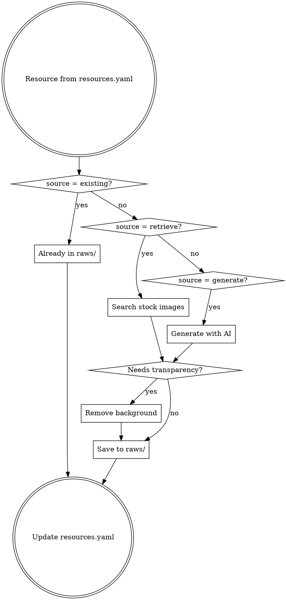

# Visual Assets

Retrieves stock images and generates custom images for video production. This step fulfills visual resource requirements defined in `manifests/resources.yaml`.

## Decision Flow



## Resource Source Types

| Source | When to Use |
|--------|-------------|
| `existing` | User-provided materials already in raws/ |
| `retrieve` | Objective backgrounds, stock photos, stock videos |
| `generate` | Custom characters, foreground elements with transparency |

### Sprite Sheets (Recommended for Character Animation)

When the storyboard includes animated characters, mascots, or any element with multiple poses/actions, **prefer generating sprite sheets** over individual images. Sprite sheets provide:

- Consistent character appearance across all animation frames
- Smooth frame-by-frame animation in Remotion
- Efficient asset management (one file per character instead of many)

### Video Resources (视频素材)

When the storyboard requires motion footage (product demos, b-roll, ambient shots), use `type: video` in resources.yaml:

```yaml
- id: demo_recording
  type: video
  description: "产品演示录屏"
  source: pexels_video
  search_keywords: ["product demo", "screen recording"]
  duration_range: "5-15s"
```

#### Video Search Strategy

- Use **Pexels Video API** for stock video retrieval
- Search keywords follow the same English-keyword rules as image search
- Filter by duration range when specified in the resource definition
- Prefer HD (1080p) or higher resolution

#### Video Output

- Storage path: `raws/videos/`
- Preferred format: MP4
- Directory structure:
  ```
  raws/
    videos/
      retrieved/
        product_demo_001.mp4
        aerial_city_002.mp4
  ```

#### Video in resources.yaml

```yaml
- id: vid_001
  type: video
  description: "Aerial city timelapse"
  source: pexels_video
  search_keywords: ["aerial city", "timelapse", "urban"]
  duration_range: "5-10s"
  path: videos/retrieved/aerial_city_001.mp4
```

---

## Image Retrieval (Stock Photos)

Search royalty-free images from Pexels and Pixabay.

### Search Keywords Tips

| Need | Keywords |
|------|----------|
| Video backgrounds | `abstract`, `texture`, `gradient`, `bokeh`, `blur` |
| Business | `office`, `meeting`, `professional`, `workspace` |
| Nature | `mountain`, `forest`, `ocean`, `sunset`, `aerial` |
| Technology | `technology`, `computer`, `coding`, `digital` |
| Minimal | `minimal`, `white background`, `flat lay`, `clean` |

### Image Search Strategy

- Use **English** keywords for all searches
- Keep search result count low (3-5) to avoid context bloat
- Use specific keywords with style descriptors for better relevance
- When initial results are poor, expand with synonyms (e.g., "server room" -> "data center", "network infrastructure")
- Filter by orientation when the layout requires it (landscape for backgrounds, portrait for mobile)
- Filter by color when brand consistency matters

### Visual Metaphor Search (视觉隐喻搜索)

When the storyboard specifies `audio_visual_relation: counterpoint`, the visual should **not** literally illustrate the narration. Instead, switch to metaphorical/associative search:

| Narrative Concept | Metaphor Search Keywords |
|-------------------|-------------------------|
| 信息过载 | overflowing water, paper avalanche, cluttered desk |
| 快速增长 | sprouting plant timelapse, rising tide, rocket launch |
| 技术落后 | vintage technology, old computer, floppy disk |
| 复杂度 | tangled wires, maze, puzzle pieces |
| 突破/创新 | breaking through wall, sunrise, butterfly emerging |
| 竞争 | race track, chess game, climbing mountain |
| 连接/协作 | bridge, handshake, puzzle fitting together |
| 衰退/消失 | wilting flower, melting ice, fading light |

**Rules:**
- Only activate metaphor search when `audio_visual_relation: counterpoint`
- For `sync` or `lead-visual`, use literal/direct search as usual
- For `lead-audio`, visuals can be more abstract/atmospheric but not necessarily metaphorical
- When using metaphor search, pick 2-3 keywords from the table and combine with style descriptors
- If the narrative concept is not in the table, derive a visual metaphor by analogy

### Framing-Aware Search (构图感知搜索)

Adjust search keywords based on the storyboard's `framing` field to find images matching the intended shot composition:

| Framing | Append to Search Keywords |
|---------|--------------------------|
| `ECU` (Extreme Close-Up) | "close up", "detail", "macro", "texture" |
| `CU` (Close-Up) | "close up", "detail", "macro", "texture" |
| `MCU` (Medium Close-Up) | (no modification, default search) |
| `MS` (Medium Shot) | (no modification, default search) |
| `LS` (Long Shot) | "wide shot", "landscape", "panoramic", "aerial" |
| `ELS` (Extreme Long Shot) | "wide shot", "landscape", "panoramic", "aerial" |

**Rules:**
- Append the framing keywords to the existing search query (do not replace)
- For `MCU` and `MS`, no framing keywords are needed
- Combine with metaphor search when applicable (e.g., counterpoint + ECU → "close up texture tangled wires")

### License Information

| Platform | License | Attribution | Commercial Use |
|----------|---------|-------------|----------------|
| Pexels | Pexels License | Appreciated but not required | Yes |
| Pixabay | CC0 / Pixabay License | Not required | Yes |

---

## Image Generation (AI)

Generate custom images via OpenAI-compatible API.

### Prompt Rules

1. **Write all prompts in English**
2. **For subjects needing transparency:** Include "on a solid white background" or "on a plain white background"
3. **For Chinese text in image:** Use format `sign that reads "Chinese text here"`
4. **Be specific:** Describe composition, style, colors, lighting, perspective

### Prompt Examples

**Background image:**
```
Abstract gradient background, soft blue to purple transition, subtle geometric patterns, clean modern aesthetic, suitable for tech presentation
```

**Character with transparency:**
```
A friendly 3D cartoon scientist character, female, wearing white lab coat and glasses, standing pose facing camera, on a plain white background, Pixar style rendering
```

**Sprite sheet:**
```
Grid: 8 columns x 4 rows.
Row 1: Idle - character breathing subtly
Row 2: Walking - 8-frame walk cycle from left
Row 3: Running - 8-frame run cycle
Row 4: Jumping - jump up and land sequence

Character: cute robot with round blue body, small antenna, expressive digital eyes.
Style: 3D cartoon, soft lighting, clean design.
```

---

## Background Removal

Remove background from generated images to create transparent subjects. Works best when the original image has a clean, solid-color background.

### Use Cases

- Characters/subjects generated on white background that need transparency
- Stock photos where only the subject is needed
- Foreground elements that will be composited over video backgrounds

---

## Sprite Sheet Validation (MANDATORY)

After generating a sprite sheet, validation is performed **automatically** by the `images_generate` tool when using `mode: sprite`. You can also run validation independently with the `images_validate_sprite` tool.

### Automatic Validation (Built-in to Generate)

When using `images_generate` with `mode: sprite`:

1. **Grid dimensions auto-detected** from the prompt (patterns like "8 columns x 4 rows"), or explicitly via `cols`/`rows` parameters
2. **Post-generation validation** runs automatically:
   - Checks image dimensions are evenly divisible by cols/rows
   - Checks magenta chroma key coverage >= 15%
3. **Auto-retry on failure** (up to `max_retries` times, default 3):
   - Each retry enhances the prompt with progressively stronger dimension constraints
   - Adds explicit pixel resolution requirements (e.g., "output MUST be 4096x2048")
4. Reports final validation result in JSON

**Recommended usage:**
```
images_generate(
  prompt="Grid: 8 columns x 4 rows. ...",
  output="/path/to/sprite.png",
  mode="sprite",
  cols=8,     # explicit is more reliable than auto-inference
  rows=4,
)
```

### Independent Validation Tool

Use `images_validate_sprite` for post-hoc validation or re-checking:

```
images_validate_sprite(
  image="/path/to/sprite.png",
  cols=8,
  rows=4,
  fix_chroma=true,        # optional: replace magenta with transparency
  output="/path/to/sprite_transparent.png",
  extract_frames="/path/to/frames/",  # optional: extract individual frames
)
```

Returns JSON with check results:
```json
{
  "success": true,
  "checks": [
    {"check": "dimensions", "passed": true, "frame_size": "512x512"},
    {"check": "aspect_ratio", "passed": true, "frame_aspect_ratio": 1.0},
    {"check": "chroma_key", "passed": true, "magenta_coverage": 42.3}
  ]
}
```

### Sprite Sheet Failure Handling

If sprite sheet generation fails after all retries:

1. Log failure details (prompt, dimensions, error) in execution summary
2. **Do NOT silently skip** — report the failure to orchestrator as `partial_failure`
3. Suggest alternatives to the user:
   - Retry with simplified prompt (fewer cells, simpler subjects)
   - Fall back to static images instead of sprite animation
   - Provide alternative asset manually
4. Continue processing remaining (non-failed) resources

### Manual Fallback Validation

If the tools are unavailable, use Python/Pillow to verify:

```python
from PIL import Image

img = Image.open("raws/images/generated/robot_sprite.png")
cols, rows = 8, 4
w, h = img.size

assert w % cols == 0, f"Width {w} not divisible by {cols} columns"
assert h % rows == 0, f"Height {h} not divisible by {rows} rows"

frame_w, frame_h = w // cols, h // rows
print(f"Sprite: {w}x{h}, Frame: {frame_w}x{frame_h}, Grid: {cols}x{rows}")
```

### Validation Checklist

| Check | Expected | Auto-handled | Manual Action if Fails |
|-------|----------|-------------|------------------------|
| Width divisible by columns | `width % cols == 0` | Yes (auto-retry with enhanced prompt) | Regenerate with explicit resolution |
| Height divisible by rows | `height % rows == 0` | Yes (auto-retry with enhanced prompt) | Regenerate with explicit resolution |
| Frame aspect ratio ~1:1 | `ratio ≈ 1.0 ± 0.3` | Warning only | Adjust cols/rows ratio |
| Magenta coverage > 15% | Background is clean | Yes (auto-retry) | Regenerate with stronger magenta instruction |
| No magenta on character | Character pixels distinct | Not auto-checked | Add "avoid magenta/pink colors on character" to prompt |
| Frame-to-frame continuity | Smooth motion | Warning only | Regenerate with "smooth transition" emphasis |

### Sprite Metadata in resources.yaml

After validation, record sprite metadata for downstream consumption:

```yaml
- id: vis_sprite_001
  type: sprite
  description: "Robot character animation"
  source: generate
  path: images/generated/robot_sprite.png
  sprite:
    cols: 8
    rows: 4
    frameWidth: 512
    frameHeight: 512
    chromaKey: "#ff00ff"
    animations:
      idle: { row: 0, frameCount: 8 }
      walk: { row: 1, frameCount: 8 }
      run: { row: 2, frameCount: 8 }
      jump: { row: 3, frameCount: 8 }
```

---

## Output Structure

```
raws/
  images/
    existing/                # User-provided (unchanged)
      logo.png
    retrieved/               # From Pexels/Pixabay
      server_room_001.jpg
      abstract_bg_002.jpg
    generated/               # From Caro LLM API
      robot.png              # With transparency
      scientist.png          # With transparency
      background_tech.png    # No transparency needed
      robot_sprite.png       # Sprite sheet (magenta bg)
  videos/
    retrieved/               # From Pexels Video API
      product_demo_001.mp4
      aerial_city_002.mp4
```

---

## Workflow

1. Read `manifests/resources.yaml` to identify visual resources
2. For each resource with `source: retrieve`:
   - Search stock images with appropriate keywords
   - Download to `raws/images/retrieved/`
3. For each resource with `source: generate`:
   - **If character/mascot with animation needs: use sprite mode** (recommended)
   - Craft appropriate prompt based on description
   - Generate the image:
     - **Normal mode**: Single generation, no validation
     - **Sprite mode**: Use `images_generate` with `mode: sprite`, `cols`, `rows` params. Built-in auto-validation and retry handles dimension/chroma issues.
   - If needs transparency (non-sprite), remove background
   - **Sprite post-processing**: After successful generation, optionally use `images_validate_sprite` with `fix_chroma=true` to convert magenta to transparency
   - Save to `raws/images/generated/`
4. Update `resources.yaml` with actual file paths (include `sprite` metadata for sprite sheets)
5. Report results to user

---

## Incremental Mode

当 dispatch context 中 mode: "incremental" 时：

### 输入
- amendment.affected_resources 中指定的新增视觉资源 ID 列表

### 执行规则
1. 读取 resources.yaml，仅定位指定的新增资源条目
2. 按 source 类型（retrieve/generate）执行获取或生成
3. 如需透明背景，执行背景移除
4. 如为 sprite sheet，执行完整验证流程
5. 更新 resources.yaml 中对应条目的 path 字段
6. 返回处理摘要（获取/生成了哪些资源）

### 不执行
- 不重新扫描已有的视觉资源
- 不重新下载或重新生成已存在的素材
- 不修改未指定资源的 path 或元数据

---

## Updating resources.yaml

After retrieving/generating images, update the resource entry with the actual path:

**Before:**
```yaml
- id: vis_001
  type: image
  description: "Server room with blue lighting"
  source: retrieve
```

**After:**
```yaml
- id: vis_001
  type: image
  description: "Server room with blue lighting"
  source: retrieve
  path: images/retrieved/server_room_001.jpg
```

---

## User Communication

### Progress Report

```
视觉素材增强进行中...

处理中: vis_003 (server room background)
  来源: Pexels
  状态: 下载完成
```

### Completion Report

```
视觉素材增强完成。

检索素材:
  - 3 张图片 (Pexels)
  - 2 张图片 (Pixabay)

生成素材:
  - 2 张图片 (带透明背景)
  - 1 张背景图

已更新: manifests/resources.yaml
输出目录: raws/images/
  - retrieved/ (5 个文件)
  - generated/ (3 个文件)

请确认素材后继续下一步。
```

---

## Common Issues

| Issue | Cause | Solution |
|-------|-------|----------|
| API key not found | Environment variable not set | Set PEXELS_API_KEY, PIXABAY_API_KEY, or CARO_LLM_API_KEY |
| Background removal messy | Original image has complex background | Use "on plain white background" in generation prompt |
| Search returns irrelevant results | Query too vague | Use specific English keywords, add style descriptors |
| Generated image style inconsistent | Prompt lacks detail | Specify art style, lighting, and composition clearly |

---

## Notes

- Always use English for search queries and generation prompts
- Keep search result count low (3-5) to avoid context bloat
- For characters/subjects, always generate on white background then remove
- **For animated characters, prefer sprite sheets** -- they produce more consistent results than generating individual frames separately
- After generating sprite sheets, always validate frame splitting before proceeding
- Update resources.yaml with actual paths after processing
- All image paths in resources.yaml are relative to raws/
