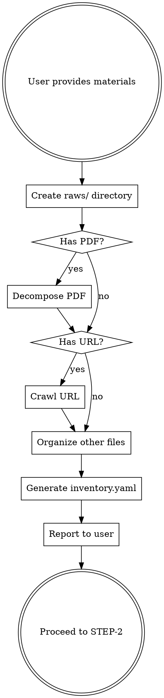

# Material Analysis

Extracts structured content from source materials (PDF, images, videos, audio) and creates an organized inventory for video production planning.

## Purpose

Transform user-provided raw materials into structured data that can drive production planning. This step creates the foundation for all subsequent workflow stages.

## Supported Input Types

| Type | Extensions | Extraction Method |
|------|------------|-------------------|
| PDF documents | .pdf | Text blocks, images, tables via material decompose tool |
| Images | .png, .jpg, .jpeg, .webp | Copied to raws/images/existing/ |
| Videos | .mp4, .mov, .webm | Copied to raws/videos/ |
| Audio | .mp3, .wav, .m4a | Copied to raws/audio/ |
| Text | .txt, .md | Read and indexed |
| URL | http/https | Text, images, tables extracted via web crawling |

## Output Structure

```
raws/
  images/
    existing/            # User-provided images (organized)
    crawled/             # Images downloaded from URL
      crawled_img_001.jpg
      crawled_img_002.png
    page_01_img_01.png   # Images extracted from PDF
    page_02_img_01.png
    table_01.png         # Table screenshots from PDF
  data.json              # Structured content from PDF or URL
  content.txt            # Plain text extraction
  inventory.yaml         # Complete material inventory
```

### data.json Format

```json
{
  "stats": {
    "total": 45,
    "pages": 12,
    "by_type": { "text": 30, "title": 5, "image": 7, "table": 3 }
  },
  "elements": [
    { "type": "title", "page": 1, "content": "Introduction" },
    { "type": "text", "page": 1, "content": "Text content from this section..." },
    { "type": "image", "page": 1, "path": "images/img_001.png" },
    { "type": "table", "page": 3, "path": "images/table_001.png", "context": {
      "before": ["Previous text for context..."],
      "after": ["Following text..."]
    }}
  ]
}
```

### inventory.yaml Format

```yaml
inventory:
  source_files:
    - name: presentation.pdf
      type: pdf
      pages: 12
      extracted: true

  images:
    - path: images/page_01_img_01.png
      source: presentation.pdf
      page: 1
      description: "Architecture diagram"

    - path: images/existing/logo.png
      source: user_provided
      description: "Company logo"

  text_blocks: 30
  tables: 2
  total_images: 7
```

## Workflow



## PDF Decomposition Patterns

When decomposing PDFs, the following extraction patterns apply:

- **Section titles**: Detected by font size changes, bold formatting, or structural patterns (e.g., "Chapter X", numbered headings)
- **Images**: Extracted at original resolution when possible, saved as `page_{NN}_img_{NN}.png`
- **Tables**: Complex table layouts may not be detected automatically; capture as screenshots saved as `table_{NN}.png`
- **Figure references**: Cross-references between text and images are preserved in data.json section entries
- **Text encoding**: UTF-8 expected; non-UTF-8 PDFs may produce encoding errors

## Manual Organization (When No PDF)

If user provides only images, videos, or other files without a PDF:

1. Create directory structure:
   ```
   raws/
     images/existing/
     videos/
     audio/
   ```

2. Copy files to appropriate directories

3. Create inventory.yaml manually:
   ```yaml
   inventory:
     source_files: []
     images:
       - path: images/existing/diagram.png
         source: user_provided
         description: "User-provided diagram"
     text_blocks: 0
     tables: 0
     total_images: 1
   ```

## Resource Source Definitions

| Source | Description | Availability |
|--------|-------------|-------------|
| `user_provided` | Files directly supplied by the user | Available in raws/images/existing/ |
| `pdf_extracted` | Images and tables extracted from PDF documents | Available after decomposition |
| `retrieve` | Stock images to be fetched from Pexels/Pixabay | Resolved in STEP-4 |
| `generate` | Custom images to be generated via Caro LLM API | Resolved in STEP-4 |
| `url_crawled` | Images downloaded from crawled web pages | Available after crawling |

## User Communication

### Successful Analysis

```
材料分析完成。

来源: presentation.pdf (12 页)

提取结果:
  文本块: 30
  图片: 5
  表格: 2

输出目录: raws/
  - data.json (结构化内容)
  - images/ (7 个文件)
  - inventory.yaml (材料清单)

请确认材料是否完整，然后继续下一步。
```

### With User-Provided Files

```
材料整理完成。

用户提供:
  - 3 张图片 -> raws/images/existing/
  - 1 个视频 -> raws/videos/
  - presentation.pdf (12 页)

PDF 提取结果:
  文本块: 30
  图片: 5

总计: 9 个可用素材

材料清单: raws/inventory.yaml
请确认后继续。
```

## Common Issues

| Issue | Cause | Solution |
|-------|-------|----------|
| PDF images blurry | Low resolution in source PDF | Use higher quality source or request original images |
| Tables not detected | Complex table layout | Extract tables manually as screenshots |
| Text encoding errors | Non-UTF8 PDF encoding | Re-export PDF with UTF-8 encoding |
| Missing sections | Title pattern mismatch | Adjust title detection parameters when invoking decompose tool |

## Exit Conditions

- **Success:** All materials organized, inventory.yaml created, proceed to STEP-2
- **Partial:** Some materials processed with warnings, user confirms to proceed
- **Failure:** Critical extraction errors, user must provide alternative materials

## File Naming Conventions

- All paths in inventory.yaml are relative to raws/
- Image filenames follow pattern: `page_{NN}_img_{NN}.png`
- Table screenshots follow pattern: `table_{NN}.png`
- User-provided files go to corresponding `existing/` subdirectories

## Incremental Mode

增量模式用于在已有素材库基础上添加新材料，不重新解析已处理的文件。

### 输入

- dispatch context 中 `amendment` 字段指定的新素材文件

### 执行规则

1. 读取现有 `raws/inventory.yaml`，了解已有素材清单
2. 仅对新增材料执行解析和组织：
   - 新 PDF 文件：执行 decompose，提取内容追加到 data.json
   - 新图片/视频/音频：复制到对应目录
3. 更新 `inventory.yaml`，追加新素材条目，保留已有条目不变
4. 不重新扫描或验证已有产物

### 产出

- 更新后的 `raws/inventory.yaml`
- 新增文件路径摘要

### 不执行

- 不重新解析已存在的 PDF
- 不重新组织已分类的文件
- 不覆盖 raws/ 中已有的文件
