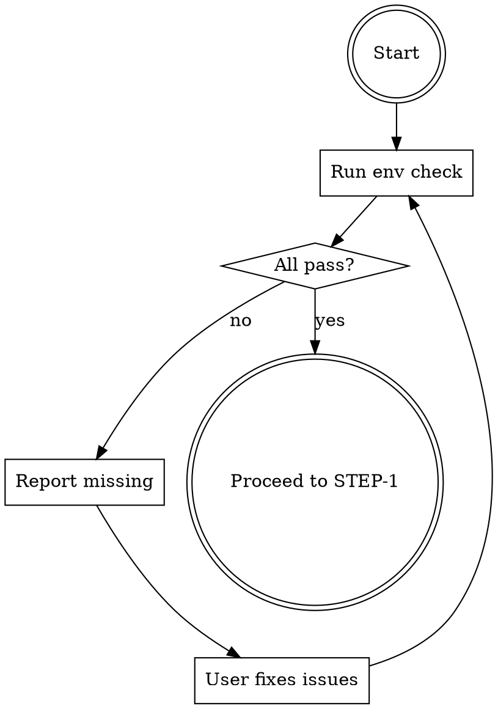

# Environment Check

Validates system requirements before starting Remotion video production. This step prevents downstream failures by ensuring all dependencies are available.

## Requirements

### System Tools

| Tool | Minimum Version | Purpose | Installation |
|------|-----------------|---------|--------------|
| Node.js | 18.0.0 | Remotion runtime | `brew install node` or nvm |
| Python | 3.9.0 | Asset processing scripts | `brew install python` |
| ffmpeg | 4.0.0 | Video encoding, audio conversion | `brew install ffmpeg` |
| ffprobe | 4.0.0 | Media duration extraction | Included with ffmpeg |

### API Keys

| Environment Variable | Purpose | How to Obtain |
|---------------------|---------|---------------|
| `PEXELS_API_KEY` | Stock image retrieval | https://www.pexels.com/api/ |
| `PIXABAY_API_KEY` | Stock image retrieval | https://pixabay.com/api/docs/ |
| `CARO_LLM_API_KEY` | AI image generation | Custom LLM API |
| `FREESOUND_API_KEY` | Sound effects retrieval | https://freesound.org/apiv2/apply/ |

**Note:** At least one of PEXELS_API_KEY or PIXABAY_API_KEY is required for image retrieval.

### Python Packages

`edge-tts` is required for voiceover generation in step-5.

### Check Scope

The environment check validates:
1. Operating system (macOS or Linux required)
2. Node.js version and npm availability
3. Python version and required packages
4. ffmpeg and ffprobe availability
5. Environment variable presence (not validity)

## Workflow



## User Communication

### All Checks Passed

```
环境检查完成。

系统状态:
  操作系统: macOS 14.0
  Node.js: v20.10.0
  Python: 3.11.5
  ffmpeg: 6.0

API 密钥状态:
  PEXELS_API_KEY: 已设置
  PIXABAY_API_KEY: 已设置
  CARO_LLM_API_KEY: 已设置
  FREESOUND_API_KEY: 已设置

Python 包:
  edge-tts: 已安装

状态: 全部通过，可以开始视频制作。
```

### With Failures

```
环境检查发现问题。

缺失项目:
  - ffmpeg: 未安装
    安装命令: brew install ffmpeg

  - FREESOUND_API_KEY: 未设置
    获取地址: https://freesound.org/apiv2/apply/
    设置命令: export FREESOUND_API_KEY="your_key"

请解决以上问题后重新运行检查。
```

## Common Issues

| Issue | Cause | Solution |
|-------|-------|----------|
| Node.js version too old | System package manager has outdated version | Use nvm to install Node.js 18+ |
| ffmpeg not found | Not installed or not in PATH | Install via Homebrew or system package manager |
| Python packages missing | Virtual environment not activated | Install packages: `pip install openai pillow numpy rembg` |
| API key not found | Environment variable not exported | Add export to shell profile (~/.zshrc or ~/.bashrc) |
| Windows detected | Windows is not supported | Use macOS or Linux |

## Exit Conditions

- **Success:** All requirements met, proceed to STEP-1 (Material Analysis)
- **Failure:** Report missing items, wait for user to resolve, re-check

Do not proceed to subsequent steps until environment check passes.

## Incremental Mode

环境检查不支持增量模式。每次调用都执行完整检查。

无论是 full、incremental 还是 resume 模式，环境检查始终执行全量验证。这确保系统状态在任何阶段都满足所有依赖要求。
