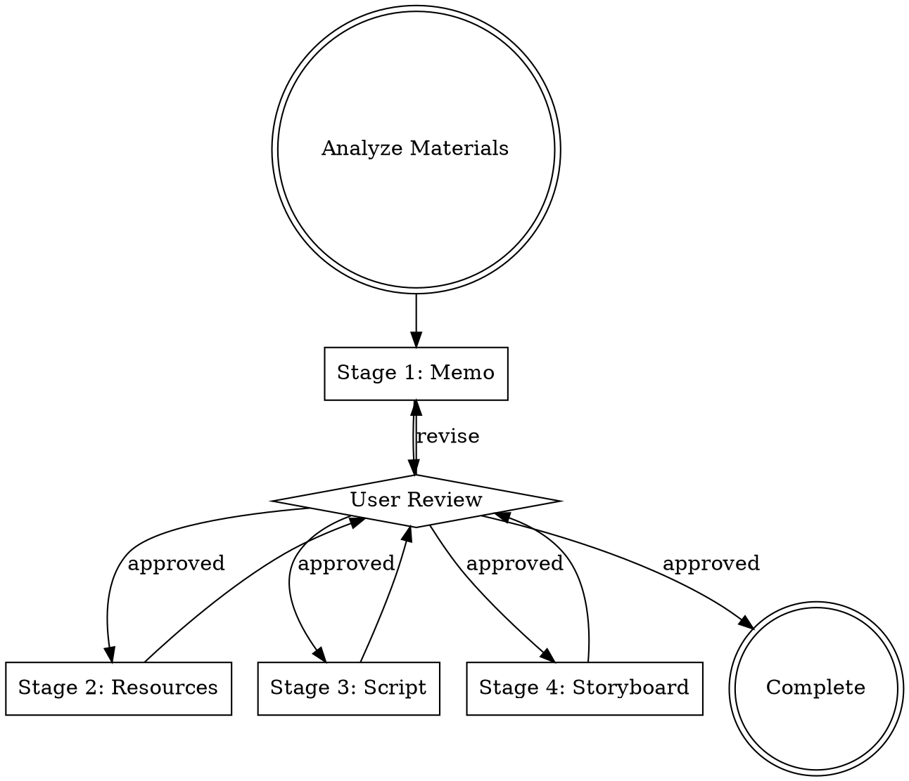

# Production Planning

Interactive video production planning that generates four core documents through guided user interaction. Each stage requires explicit user approval before proceeding.

## Overview

This skill guides users through professional filmmaking workflows, generating production documents that follow industry standards. The output drives all subsequent implementation phases.

## Output Documents — FIXED PATHS (CRITICAL)

**你必须将文件写入以下精确路径。禁止修改文件名、禁止创建新目录、禁止使用项目名或自定义名称。**

| Document | EXACT Path (不可修改) | Purpose |
|----------|----------------------|---------|
| Creative Memo | `manifests/memo.md` | Vision, tone, technical specs |
| Resources | `manifests/resources.yaml` | Asset and character definitions |
| Script | `manifests/script.md` | Voiceover lines with [VO_XXX] markers |
| Storyboard | `manifests/storyboard.yaml` | Shot-by-shot breakdown |

违规示例（绝对禁止）：
- ~~`memo/killer-story.md`~~ — 禁止创建 memo/ 目录
- ~~`storyboard/my-storyboard.yaml`~~ — 禁止创建 storyboard/ 目录
- ~~`manifests/killer-memo.md`~~ — 禁止自定义文件名

如果 dispatch_context 中包含 `output_rules` 字段，以其中的绝对路径为准。

## Workflow



**Each stage:** Ask questions -> Generate document -> Show to user -> Accept feedback -> Iterate -> Confirm approval -> Next stage

---

## Professional Standards (Built-in)

All outputs must implicitly follow these principles:

### Seven Laws of Editing

1. **Action Continuity** - Cut on movement to mask transitions
2. **Eyeline Match** - Preserve screen direction and gaze logic
3. **180-degree Rule** - Maintain spatial consistency across cuts
4. **30-degree Rule** - Camera angle changes must exceed 30 degrees to avoid jump cuts
5. **Match Cut** - Match composition, movement, or subject across cuts
6. **Jump Cut Awareness** - Use deliberately or avoid entirely
7. **Montage Theory** - Juxtaposition creates meaning beyond individual shots

### Cinematography Standards

**Shot Sizes:** ECU (Extreme Close-Up), CU, MCU, MS, MLS, LS, ELS, XLS

**Camera Movements:** Static, Push In, Pull Out, Pan, Tilt, Dolly, Track, Crane, Handheld

**Angles:** Eye Level, High Angle, Low Angle, Dutch Angle, Overhead, Worm's Eye

**Lighting References:** Key/Fill/Back, Hard/Soft, Natural/Motivated

**Forbidden Language:** "amazing", "stunning", "breathtaking", "beautiful" - use technical precision instead

---

## Storytelling Craft — 盖曼讲故事法则

Based on Neil Gaiman's MasterClass "The Art of Storytelling". These principles must be internalized and applied throughout all four planning stages. They are not optional add-ons — they are the foundation of every creative decision.

### 1. 叙事引擎 (Narrative Engine)

Every video needs a **narrative engine** — the invisible force that compels viewers to keep watching. Before writing any script, identify:

- **What question does the viewer need answered?** The opening must plant a question that demands resolution.
- **What is at stake?** Without stakes (emotional, intellectual, or practical), there is no story — only information.
- **What is the promise to the viewer?** The first 10 seconds make an implicit promise about what the video will deliver. You must keep that promise.

让别人从你的视角看世界，比直接陈述经历更重要。找到驱动观众看下去的引擎是一切的核心。

### 2. 灵感堆肥法 (Compost Heap Method)

Do not rush from material analysis to script. Let ideas ferment:

- Combine **two or more unrelated ideas** from the source material to create something original
- Ask "What if...?" questions: What if this data told a personal story? What if we showed the consequence before the cause?
- The best narratives emerge from **unexpected connections**, not linear summaries of source content
- 不急着开始写。把素材分析的结果放在脑中沉淀，让不同想法自然组合。灵感来自好奇心、经验和意外的交汇。

### 3. 冰山理论 (Iceberg Theory)

Show only the tip. The power of a story comes from what is **implied but not stated**:

- Do not explain everything. Let visuals carry subtext that words do not spell out.
- Each shot should suggest a world larger than what is visible on screen
- A 3-minute video built on solid research feels deeper than a 10-minute video that states every fact
- **Rule:** For every fact included in the script, at least two supporting facts should inform the visuals and tone but remain unspoken

### 4. 叙事声音 (Narrative Voice)

Every video must have a **consistent narrative voice** — the personality behind the words:

- **叙事者的声音 (Narrator Voice)** — the overall tone and attitude: authoritative, intimate, playful, contemplative, etc.
- **角色情绪的声音 (Character Emotional Voice)** — when characters or subjects appear, their emotions must be specific and grounded, not generic
- Short-form videos demand a strong, distinctive voice from the very first line
- Long-form videos can let the voice evolve gradually, but the core personality must remain stable throughout
- 必须保持一种统一的叙事口吻。The voice is the contract between creator and audience.
- **Test:** Read the script aloud. If any line could belong to a different video, rewrite it.

### 5. 人物与情节推进 (Character & Plot Progression)

Even in non-fiction, explainer, or data-driven videos, apply character-driven storytelling:

- **Initial State (初始状态)** — Establish where the subject or audience stands at the beginning: ignorance, confusion, a problem, a desire
- **Personality Drives Plot (性格推进)** — How does the subject's nature determine what happens next? Facts alone don't create narrative; the *way* facts are revealed creates meaning.
- **Event-Driven Turns (事件推进)** — Each chapter must contain at least one moment that shifts the viewer's understanding or emotion. The Plot's core must be triggered or changed (Plot的核心被激起/改变).
- **Endings > Beginnings (结尾比开头更重要)** — The final impression determines how viewers remember the entire video. End with resonance, not summary. Never end with a generic positive conclusion.

### 6. 幽默感 (Humor)

Gaiman insists stories need humor, even serious ones:

- Humor creates **trust** between narrator and audience — it signals that the creator is human
- One well-placed unexpected observation is worth more than any amount of earnest explanation
- Humor can be structural (unexpected juxtaposition of shots), visual (an ironic image), or verbal (a single wry line)
- **Never force humor.** If it doesn't arise naturally from the material, don't manufacture it. Forced humor is worse than no humor.

### 7. 对白法则 (Dialogue Craft)

When writing voiceover or character dialogue:

- Every line must serve at least one purpose: advance the narrative, reveal character, or provide essential information
- Lines that serve none of these must be cut — no matter how well-written
- Natural speech has rhythm, interruption, and emphasis — it does not sound like written prose read aloud
- **The best dialogue sounds like it was overheard, not composed**
- 人物对白要让观众觉得是偷听到的，不是被灌输的

### 8. 不可能让所有人满意 (You Can't Please Everyone)

- Choose a specific audience and commit fully. A video that tries to be everything to everyone connects with no one.
- Bold creative choices will alienate some viewers — this is acceptable and necessary
- The Creative Memo (Stage 1) should explicitly define who this video is **NOT** for
- 从你的经验出发，空想没有用。Make creative decisions grounded in the material, not in imagined universal appeal.

### 盖曼八条写作规则 (Gaiman's 8 Rules for Writers)

Apply these throughout the planning process:

1. **Write.** Start generating ideas and text, don't wait for perfection.
2. **Put one word after another.** Build the script incrementally, sentence by sentence.
3. **Finish what you start.** Complete all four planning documents; half-done plans produce half-done videos.
4. **Put it aside.** After drafting each stage document, step back before reviewing — fresh eyes catch what tired eyes miss.
5. **Come back to it.** Re-read with the audience's perspective, not the creator's.
6. **Edit ruthlessly.** Fix muddled passages, cut redundant sections, tighten the narrative arc.
7. **Do a final self-check before delivery.** Verify the entire plan coheres: memo → resources → script → storyboard must tell one unified story.
8. **Keep writing (坚持).** Iteration is expected. Each revision makes the story stronger.

---

## Stage 1: Creative and Technical Memo

### Questions to Ask

1. **Video Type** - Knowledge/Tutorial, Commercial/Brand, News/Documentary, Narrative/Story, Vlog/Lifestyle, Other
2. **Core Objective** - What should audience feel/know/do after watching?
3. **Target Audience** - Age range, interests, viewing context
4. **Who is this NOT for?** - Explicitly exclude audiences to sharpen creative focus (盖曼法则：不可能让所有人满意)
5. **Narrative Engine** - What question or tension drives the viewer to keep watching? What is at stake? (盖曼法则：叙事引擎)
6. **Emotional Tone** - Serious, Lighthearted, Humorous, Emotional, Tense, Inspiring
7. **Emotional Arc** - How should emotions evolve from opening to closing? Where are the turns? (盖曼法则：情节推进)
8. **Narrative Voice** - What personality does the narrator have? Authoritative, intimate, playful, contemplative? (盖曼法则：叙事声音)
9. **Visual Style** - Realistic, Flat Design, Hand-drawn, 3D, Mixed Media; Color palette preference
10. **Duration** - 15s / 30s / 60s / 3min / 5min / 10min / Custom
11. **Technical Specs** - Resolution (1080p/4K), Aspect Ratio (16:9/9:16/1:1), Frame Rate (24/30/60fps)

### Output Format (memo.md)

```markdown
# Video Production Memo

**Project:** [Project Name]
**Date:** [Creation Date]
**Version:** 1.0

## Creative Direction

### Core Theme
[What is this video fundamentally about? One sentence that captures the essence.]

### Narrative Engine
[What question/tension drives viewers to keep watching? What is at stake? What promise does the opening make?]

### Narrative Voice
[Define the narrator's personality: tone, attitude, relationship with audience. This voice must remain consistent throughout.]

### Narrative Strategy
[Three-act structure / Problem-solution / Chronological / Comparative analysis — with specific turning points identified]

### Emotional Arc
[Describe how viewer emotions should evolve throughout. Reference specific chapter transitions. Where are the surprises, the tension peaks, the release moments?]

### Audience
- **For:** [Target audience with specific traits]
- **Not For:** [Who this video deliberately excludes — sharpens creative decisions]

### Humor Strategy
[Where does natural humor arise from the material? If no humor fits, state explicitly: "Material does not support humor — maintain earnest tone throughout."]

### Visual References
[Describe style influences using specific references, avoiding generic terms]

## 情绪曲线

[规划每个时间段的情绪走向，确保整体张力呈波浪形、节奏有变化。此表直接指导 Stage-4 的 visual_tension 和 pacing 字段。]

| 时间段 | 情绪 | 张力(0-1) | 节奏 | 对应章节 |
|--------|------|-----------|------|---------|
| 0:00-0:30 | 好奇 | 0.3→0.5 | medium | 开场悬念 |
| 0:30-2:00 | 沉浸 | 0.5→0.6 | slow | 现象展示 |
| 2:00-2:15 | 震惊 | 0.6→0.9 | fast | 反转/冲突 |
| 2:15-3:30 | 理解 | 0.9→0.4 | slow→medium | 深入解析 |
| 3:30-4:00 | 共鸣 | 0.4→0.7 | slow | 结尾升华 |

## Technical Specifications

- **Duration:** [XX] seconds / [X.X] minutes
- **Resolution:** [1920x1080 / 3840x2160]
- **Aspect Ratio:** [16:9 / 9:16 / 1:1]
- **Frame Rate:** [24 / 30 / 60] fps
- **Delivery Format:** [MP4 H.264 / ProRes]
```

---

## Stage 2: Resource and Character Definitions

### Questions to Ask

1. **Character Count** - How many speaking/visible characters?
2. **For each character** - Name, role, personality/visual traits
3. **Visual Assets Needed** - Live action, animation, graphics, stock footage, screen recordings
4. **Audio Assets Needed** - Voiceover style, music genre/mood, sound effects
5. **Structured Data** - Charts, tables, data visualizations needed?

### Data Extraction Task

After gathering requirements, analyze user's materials to extract structured data:
- Parse numerical data from documents
- Identify comparison tables, timelines, statistics
- Organize data for charts (bar, line, pie)
- Structure datasets for on-screen tables or infographics

### Output Format (resources.yaml)

```yaml
resources:
  visual:
    - id: vis_001
      type: image
      description: "Precise description of visual content and purpose"
      source: existing | retrieve | generate

    - id: vis_002
      type: video
      description: "Another visual asset"
      duration_ms: 5000
      source: existing | retrieve | generate

  audio:
    - id: aud_001
      type: voiceover
      description: "Male voice, mid-tempo, explanatory tone, warm and authoritative"

    - id: aud_002
      type: music
      description: "Upbeat electronic background, 120 BPM, minimal melody to support voice"

    - id: aud_003
      type: sfx
      description: "Transition whoosh sound, short duration"

  data:
    - id: data_001
      type: table
      description: "Comparison table showing three product features"
      structure:
        headers: ["Feature", "Product A", "Product B", "Product C"]
        rows:
          - ["Price", "$99", "$149", "$199"]
          - ["Storage", "128GB", "256GB", "512GB"]

    - id: data_002
      type: chart
      description: "Line chart showing growth over 5 years"
      structure:
        chart_type: line
        x_axis: ["2020", "2021", "2022", "2023", "2024"]
        y_axis: [120, 145, 178, 210, 265]
        x_label: "Year"
        y_label: "Revenue (Million USD)"

    - id: data_003
      type: statistics
      description: "Key metrics displayed as callout numbers"
      structure:
        metrics:
          - label: "Active Users"
            value: "2.5M"
          - label: "Satisfaction Rate"
            value: "98%"

characters:
  - id: char_001
    name: "Narrator"
    description: "Professional voice, clear pronunciation, measured pace. Conveys expertise without condescension."

  - id: char_002
    name: "Animated Character"
    description: "Stylized 3D mascot with simple expressions. Movement should be smooth, never cartoonish."
```

### Resource Source Types

| Source | When to Use | STEP Reference |
|--------|-------------|----------------|
| `existing` | User-provided in raws/ | Already available |
| `retrieve` | Stock image/video from Pexels/Pixabay | STEP-4 |
| `generate` | AI-generated custom image | STEP-4 |

---

## Stage 3: Shooting Script

### Questions to Ask

1. **Chapter Count** - How many major sections/chapters?
2. **For each chapter** - What's the main point or information? What **turns** (shifts in understanding or emotion) does it contain?
3. **Opening Hook** - What question or image grabs the viewer in the first 5 seconds? (叙事引擎的第一次点火)
4. **Ending Resonance** - How does the video end? Avoid generic summaries. End with an image, a question, or a moment that lingers. (结尾比开头更重要)
5. **Narrative Pacing** - Where should rhythm speed up (tension, revelation) and slow down (reflection, beauty)?

### Script Writing Craft (盖曼法则)

Apply these principles when writing each chapter:

**Voice Consistency** — Every line must sound like it comes from the same narrator established in the memo. Read aloud: if a line could belong to a different video, rewrite it. 必须保持统一的叙事口吻。

**Iceberg Principle** — Do not state everything. For each fact in the script, let supporting context live in the visuals rather than the voiceover. The script should feel like the visible tip of deep knowledge. 写出来的只是冰山一角。

**Show, Don't Summarize** — Prefer specific examples, numbers, and moments over abstract statements. "三年前处理10万条消息，现在500万条" is stronger than "消息处理能力显著提升".

**Dialogue Over Declaration** — When quoting or paraphrasing, make it sound overheard, not composed. Natural speech has rhythm and imperfection. 对白要像偷听到的，不是灌输的。

**Humor Where Natural** — If the material supports a wry observation, an unexpected comparison, or a moment of levity, include it. Do not force humor into material that does not support it.

**Chapter Turns** — Each chapter must contain at least one moment that shifts the viewer's understanding or emotion. A chapter with no turn is just information — not story. Plot的核心必须被激起或改变。

**Cut Ruthlessly** — Every VO line must advance the narrative, reveal something about the subject, or provide essential information. Lines that do none of these must be deleted, no matter how well-written. 编辑要狠。

### Output Format (script.md)

```markdown
# Video Shooting Script

## Chapter 1: [Chapter Title]

### Purpose
[What this section accomplishes in the overall narrative]

### Narrative Turn
[What shift in understanding or emotion occurs in this chapter? Every chapter must have at least one turn.]

### Visual Approach
[General description of how this section will look - not shot-by-shot, but overall visual strategy. Apply iceberg principle: what do visuals convey that words do not?]

### Voiceover

- **[VO_001]** "Opening sentence that hooks viewer attention — plant the question or tension."
- **[VO_002]** "Second sentence developing the hook into main theme."
- **[VO_003]** "Transition to key concept — use specific detail, not abstract statement."

---

## Chapter 2: [Chapter Title]

### Purpose
[Narrative function of this section]

### Narrative Turn
[The specific moment that shifts the viewer's understanding or emotion]

### Visual Approach
[Visual strategy — what does this chapter show that the words leave unsaid?]

### Voiceover

- **[VO_004]** "Content continues with clear numbered references."
- **[VO_005]** "Each line has unique ID for storyboard linking."

---

[Continue for all chapters]
```

### Voiceover Numbering Rules

- Format: `[VO_XXX]` where XXX is zero-padded (VO_001, VO_002, ..., VO_099, VO_100)
- **Sequential across entire script** - Do NOT restart numbering per chapter
- Each VO line represents one semantic unit (one or multiple sentences)
- Storyboard shots reference these VO IDs to link visuals with narration

---

## Stage 4: Shot-by-Shot Storyboard

### Questions to Ask

1. **Shot-to-Voiceover Ratio** - How many shots per semantic segment? (Flexible recommended)
2. **Camera Style** - Mostly static compositions or dynamic camera movement?
3. **Transition Style** - Primarily hard cuts or use dissolves/fades?

### Important Note

Shots do not need to align 1:1 with voiceover lines. One shot may span multiple VO segments, or one VO may be illustrated by multiple shots. The storyboard should be driven by visual storytelling logic, not script structure.

### Storytelling in Visual Sequencing (盖曼法则)

- **Iceberg in Visuals** — Each shot should carry subtext that the voiceover does not explain. If the VO says "growth was steady," the visuals can show the struggle behind that growth. 视觉承载文字未说出的故事。
- **Montage Theory meets Narrative Engine** — The juxtaposition of shots creates meaning beyond individual images. Use this to sustain the narrative engine: each cut should raise a new micro-question or answer a previous one.
- **Emotional Arc in Shot Progression** — The sequence of shot sizes, angles, and movements should mirror the emotional arc defined in the memo. Intimate moments use close-ups; revelations use wide shots; tension uses tighter framing.
- **Ending Shot** — The final shot must leave a lasting impression. Avoid ending on text/data. End on an image that resonates with the video's core theme. 结尾的画面决定观众记住什么。

### Output Format (storyboard.yaml)

```yaml
storyboard:
  - shot_id: shot_001
    chapter: "Ch1"
    duration_ms: 3000
    visual_description: "Medium close-up (MCU) of subject, eye level, static camera. Soft key light from camera right, minimal shadows. Background shows blurred environment (bokeh)."
    voiceover_refs: [VO_001]
    resource_refs: [char_001, aud_001]

    # ── 视觉语言字段 ──
    framing: "MCU"                    # 景别
    camera_movement: "static"         # 运镜效果（对应 KenBurns 组件的 effect）
    pacing: "medium"                  # 节奏
    visual_tension: 0.4               # 视觉张力 0.0-1.0
    audio_visual_relation: "sync"     # 声画关系
    transition_in:                    # 入场转场
      type: "fade"
      duration_ms: 500
    breathing: false                  # 是否为呼吸段

  - shot_id: shot_002
    chapter: "Ch1"
    duration_ms: 2500
    visual_description: "Extreme close-up (ECU) of hands interacting with object, slightly high angle, static. Sharp focus on object, hands slightly out of focus. Hard lighting creates clear shadows."
    voiceover_refs: [VO_002]
    resource_refs: [vis_003, aud_001]

    framing: "ECU"
    camera_movement: "static"
    pacing: "medium"
    visual_tension: 0.5
    audio_visual_relation: "sync"
    transition_in:
      type: "cut"
      duration_ms: 0
    breathing: false

  - shot_id: shot_003
    chapter: "Ch1"
    duration_ms: 4000
    visual_description: "Wide shot (WS) of environment, eye level, slow push in (0.5s duration). Fluorescent overhead lighting, clinical color temperature. Subject visible at far end, establishing spatial context."
    voiceover_refs: [VO_003, VO_004]
    resource_refs: [char_001, aud_002]

    framing: "LS"
    camera_movement: "slow-push"
    pacing: "slow"
    visual_tension: 0.3
    audio_visual_relation: "lead-visual"
    transition_in:
      type: "wipe-left"
      duration_ms: 600
    breathing: false

  - shot_id: shot_003b
    chapter: "Ch1-Ch2"
    duration_ms: 2500
    visual_description: "Breathing space: soft gradient background, no text, no subject. Slow dissolve in and out."
    voiceover_refs: []
    resource_refs: [aud_002]

    framing: "ELS"
    camera_movement: "static"
    pacing: "pause"
    visual_tension: 0.1
    audio_visual_relation: "sync"
    transition_in:
      type: "dissolve-blur"
      duration_ms: 800
    breathing: true

  - shot_id: shot_004
    chapter: "Ch2"
    duration_ms: 3500
    visual_description: "Animated data visualization: bar chart growing from zero to final values on dark background. Smooth animation over 2 seconds, then hold. Soft rim lighting creates depth."
    voiceover_refs: []
    resource_refs: [data_001]

    framing: "MS"
    camera_movement: "slow-push"
    pacing: "medium"
    visual_tension: 0.6
    audio_visual_relation: "sync"
    transition_in:
      type: "fade"
      duration_ms: 500
    breathing: false
```

### 视觉语言字段参考

以下字段为每个 shot 必填。它们为下游 Remotion 组件提供直接参数映射。

#### framing 景别

| 值 | 含义 | 适用场景 |
|----|------|---------|
| ECU | 极特写 | 纹理、细节、情感高潮 |
| CU | 特写 | 人物表情、物件重点 |
| MCU | 中近景 | 人物上半身、产品展示 |
| MS | 中景 | 默认，信息展示 |
| MLS | 中远景 | 环境+主体 |
| LS | 远景 | 场景展示、建立空间 |
| ELS | 大远景 | 宏观概念、开场/结尾 |

#### camera_movement 运镜

对应 KenBurns 组件的 `effect` 参数：

| 值 | KenBurns effect | 情感含义 |
|----|----------------|---------|
| static | 不使用 KenBurns | 稳定、客观陈述 |
| slow-push | zoom-in | 逐渐聚焦、引起注意 |
| slow-pull | zoom-out | 揭示全貌、释放张力 |
| pan-left | pan-left | 时间推进、展示连续 |
| pan-right | pan-right | 时间推进、展示连续 |
| pan-up | pan-up | 上升、积极情绪 |
| pan-down | pan-down | 沉降、沉思 |
| zoom-corner | zoom-in-top-left/right/bottom-left/right | 聚焦特定区域 |

#### pacing 节奏

| 值 | shot 时长范围 | 动画速度 | 适用场景 |
|----|-------------|---------|---------|
| slow | 5-10s | 0.6x | 沉思、情感、留白 |
| medium | 3-5s | 1.0x | 默认，信息传达 |
| fast | 1-3s | 1.5x | 紧张、数据密集、快切蒙太奇 |
| pause | 2-3s | 0.3x | 呼吸段、章节过渡 |

#### visual_tension 视觉张力

- 0.0-0.3: 平静、空旷构图、大留白
- 0.3-0.6: 中等、均衡构图
- 0.6-0.8: 紧张、元素密集、动画幅度大
- 0.8-1.0: 高潮、极端构图、快速动画

#### audio_visual_relation 声画关系

| 值 | 含义 | audio_offset 效果 |
|----|------|------------------|
| sync | 声画同步（默认）| offset = 0 |
| lead-visual | 画面先于旁白出现 | 画面提前 300-1000ms |
| lead-audio | 旁白先于画面 | 旁白提前 300-500ms |
| counterpoint | 画面展示隐喻/对比 | offset = 0，但画面内容与旁白不直接对应 |

#### transition_in 转场

`transition_in` 为结构体，包含 `type` 和 `duration_ms` 两个字段：

| type 值 | 含义 |
|---------|------|
| cut | 硬切（无过渡） |
| fade | 淡入淡出 |
| circle-wipe | 圆形擦除 |
| diagonal-wipe | 对角线擦除 |
| iris | 菱形展开 |
| curtain | 幕布打开 |
| blinds | 百叶窗 |
| zoom-fade | 缩放淡入 |
| dissolve-blur | 模糊溶解 |
| wipe-left | 水平向左擦除 |
| wipe-right | 水平向右擦除 |
| mask-circle | 圆形遮罩揭示 |
| mask-rectangle | 矩形遮罩揭示 |

#### breathing 呼吸段

- `true`: 该 shot 为呼吸段（无旁白，2-3秒，用于章节过渡）
- `false`: 常规 shot（默认）

### Visual Description Requirements

Must include (where applicable):

- **Shot Size** - ECU, CU, MCU, MS, MLS, LS, ELS with subject specified
- **Camera Angle** - Eye level, High angle, Low angle, Dutch, Overhead
- **Camera Movement** - Static OR specific movement with duration/speed
- **Lighting** - Quality (hard/soft), direction, color temperature
- **Focus** - What's sharp, what's blurred, any focus pulls
- **Composition** - Subject placement, rule of thirds, headroom, lead room

### Language Guidelines

Use technical precision, not emotional language:

| Wrong | Correct |
|-------|---------|
| "beautiful lighting" | "Soft key light from camera right" |
| "dramatic camera move" | "Slow push in over 2 seconds" |
| "perfectly framed" | "Subject in left third, looking right (lead room)" |
| "stunning visual" | "High contrast silhouette against bright background" |

### Voiceover Reference Guidelines

- `voiceover_refs` links shot to corresponding VO line(s) from script.md
- List format: `[VO_001]` or `[VO_001, VO_002, VO_003]` for multiple lines
- Use empty list `[]` for shots with no voiceover (B-roll, transitions)
- One shot can cover multiple VOs if they form a semantic unit

### Resource Reference Guidelines

- `resource_refs` lists ALL resource IDs used in this shot
- Include visual (vis_*), audio (aud_*), data (data_*), characters (char_*)
- Only reference IDs that exist in resources.yaml

### 节奏设计规则

1. **呼吸感**：快-慢-快-停顿 的节奏交替，禁止所有 shot 使用相同时长
2. **章节过渡**：每个 chapter 之间必须插入一个 `breathing: true` 的 shot（2-3秒，无旁白）。`breathing: true` 和 `pacing: "pause"` 必须同时出现——`breathing: true` 是规范标识，`pacing: "pause"` 确保下游正确处理时长和 TTS 跳过。
3. **信息密度**：
   - 关键论点 shot: pacing=medium, 3-5s
   - 数据/对比展示: pacing=fast, 1-3s
   - 情感/结论: pacing=slow, 5-8s
   - 开场悬念: pacing=medium→fast, 递进
   - 结尾余韵: pacing=slow, 最后一个 shot 至少 5s
4. **张力曲线**：整体 visual_tension 应呈现波浪形，不能单调递增或保持平坦
5. **转场多样性**：连续 3 个 shot 不能使用相同的 transition_in.type
6. **运镜多样性**：连续 3 个 shot 不能使用相同的 camera_movement

### 声画关系规则

- 默认使用 `sync`（声画同步）
- 在揭示性 shot（即将展示重要内容）时使用 `lead-visual`（画面先出）
- 在悬念 shot（先听到描述再看到画面）时使用 `lead-audio`
- 在需要隐喻、对比的 shot 时使用 `counterpoint`
- 一个完整视频中至少有 20% 的 shot 使用非 sync 的声画关系

---

## Stage 5: Completion

After all four documents approved:

1. Confirm all files written to `manifests/`
2. Provide summary:
   - Total duration calculated from storyboard
   - Shot count
   - Resource count
   - Character count
3. Inform user ready for STEP-3 (Script Humanization)

---

## User Communication

### After Each Stage

```
[阶段名称] 文档生成完成。

文件位置: manifests/[filename]

请审阅并提供反馈。确认无误后回复"继续"进入下一阶段。
```

### After Final Stage

```
生产规划完成。

概要:
  总时长: 4分23秒 (263秒)
  分镜数: 38
  资源数: 25 (15 视觉, 8 音频, 2 数据)
  角色数: 2

文档目录: manifests/
  - memo.md
  - resources.yaml
  - script.md
  - storyboard.yaml

准备进入 STEP-3 文稿润色阶段。
```

---

## Common Pitfalls

| Mistake | Correction |
|---------|------------|
| Moving to next stage without approval | Always wait for explicit user confirmation |
| Using marketing language in visuals | Use technical cinematography terms only |
| Restarting VO numbering per chapter | Sequential numbering across entire script |
| Vague shot descriptions | Must include shot size, angle, movement, lighting |
| Missing voiceover_refs in storyboard | Every shot must include voiceover_refs (even if empty) |
| Missing resource_refs in storyboard | Every shot should reference its used resources |
| Invalid resource IDs | Only reference IDs that exist in resources.yaml |
| Missing required cinematic fields | Every shot must have ALL fields: framing, camera_movement, pacing, visual_tension, audio_visual_relation, transition_in (struct), breathing |
| Invalid enum values | framing must be one of: ECU/CU/MCU/MS/MLS/LS/ELS; camera_movement must be one of the defined enum values; pacing must be slow/medium/fast/pause |
| visual_tension out of range | Must be numeric 0.0-1.0 |
| Forcing 1:1 shot-to-VO mapping | Use semantic grouping based on visual logic |
| No narrative engine defined | Memo must identify what drives viewers to keep watching |
| Script reads like a summary | Apply iceberg theory: state less, imply more |
| Chapters without turns | Every chapter must shift understanding or emotion |
| Generic ending ("bright future") | End with resonance — a specific image or thought that lingers |
| Inconsistent narrator voice | All VO lines must sound like the same person speaking |
| Trying to please everyone | Define who video is NOT for; commit to specific audience |
| Voiceover explains what visuals already show | Let visuals and words work in counterpoint, not redundancy |
| All shots same duration/pacing | Use 快-慢-快-停顿 rhythm; vary pacing across shots |
| Missing breathing shots between chapters | Every chapter transition needs a `breathing: true` shot |
| Flat visual_tension curve | Tension should be wave-shaped, matching memo 情绪曲线 |
| Same transition_in for 3+ consecutive shots | Vary transition types; no 3 identical in a row |
| Same camera_movement for 3+ consecutive shots | Vary camera movement; no 3 identical in a row |
| 100% sync audio_visual_relation | At least 20% of shots should use non-sync relations |
| Missing 情绪曲线 in memo | Memo must include emotion curve table linking to storyboard fields |
| transition_in as plain string | transition_in is a struct with type and duration_ms |

---

## Notes

- **All time units in milliseconds** throughout YAML files
- **VO 编号间隔**：如果删除了某个 VO 段落，不要重新编号，保留间隔（如 VO_001, VO_003）。纯视觉 shot 的 voiceover_refs 为空列表 `[]`，不占用 VO 编号。编号始终为 3 位数字零填充（VO_001），超过 999 则自动扩展（VO_1000）。
- **Fixed filenames** - Do not add project names or timestamps. 文件名必须严格为 `memo.md`、`resources.yaml`、`script.md`、`storyboard.yaml`
- **Fixed directories** - 只写入 `manifests/` 目录，绝对不创建 `memo/`、`script/`、`storyboard/`、`resources/` 等新目录
- **Iteration is expected** - Users will request changes, handle gracefully
- **Professional terminology** - Enforce cinematography vocabulary

When user signals completion with "looks good", "approved", "continue", or "next", proceed to following stage without re-asking.

---

## Incremental Mode

增量模式用于在已完成的策划基础上进行局部修改，不重新生成整套策划文档。

### 添加新镜头 (add_new_shot)

1. 读取现有 `manifests/storyboard.yaml`，了解当前 shot 列表和编号
2. 读取现有 `manifests/script.md`，了解当前 VO 编号范围
3. 根据用户需求，在 storyboard.yaml 中追加新 shot 条目：
   - shot_id 延续现有编号（如已有 shot_012，新增为 shot_013）
   - 如需新 VO，在 script.md 对应章节追加新 VO 行，编号延续
4. 如新 shot 需要新素材，在 `manifests/resources.yaml` 追加资源条目
5. 不修改已有 shot 的定义（除非用户明确要求调整相邻 shot 的过渡）

### 修改脚本段落 (modify_script_segment)

1. 读取现有 `manifests/script.md`
2. 仅修改用户指定的 VO 段落内容
3. 保持 VO 编号不变（[VO_XXX] 标记不更改）
4. 如修改导致时长显著变化，提示用户是否需要调整对应 shot 的 duration_ms

### 产出

- 更新后的策划文档（仅修改涉及的文件）
- 变更摘要，列出修改的 shot_id 和 VO_id

### 不执行

- 不重新生成未受影响的策划文档
- 不重新提问已回答过的策划问题
- 不修改用户未指定的内容
