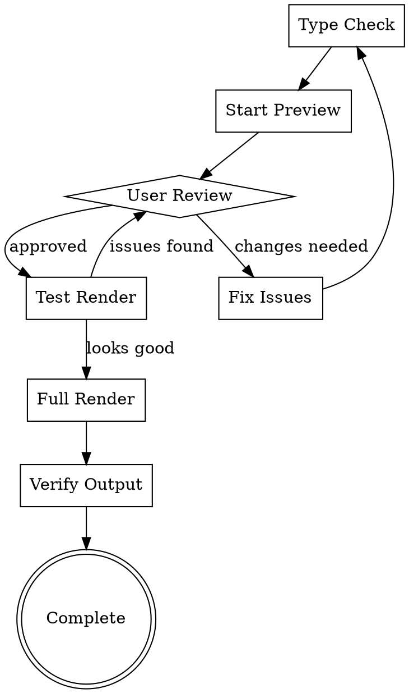

# Preview and Render

Preview, debug, iterate with user feedback, and render final Remotion video. This phase validates the implementation and produces the deliverable.

## Incremental Mode

When reviewing amendments rather than a full build:

- **Restart preview:** The platform auto-restarts the Remotion Studio when files change. Verify the preview reflects the latest changes.
- **Focus on amendment-affected shots:** Prioritize reviewing the specific shots that were modified. Check adjacent shots for side effects (timing shifts, layout overlap).
- **Verify no side effects:** After targeted changes, scrub through the full timeline to confirm no unintended regressions in other chapters.

---

## Issue Severity Classification

When reviewing the preview, classify issues by severity to determine the correct action:

### minor (self-fix by reviewer)

Issues the reviewer can fix directly without returning to the builder:

- CSS tweaks: position adjustments within +/-4px
- Timing adjustments: +/-5 frames
- Typos in text content
- Single easing function changes
- Opacity fine-tuning
- Minor color shade adjustments
- KenBurns 速度过快/过慢 → 调整 effect 或 scaleFrom/scaleTo
- 文字动画节奏不匹配 → 调整 AnimatedText 的 stagger/speed/delaySec
- 呼吸段过长/过短 → 调整 BreathingSpace 所在 Sequence 的 durationInFrames
- 背景过于单调 → 更换 DynamicBackground variant
- 转场过于突兀 → 延长 transition duration 或换用 dissolve-blur

### major (return to builder)

Issues that require the builder agent to fix:

- Animation logic errors (wrong interpolate ranges, broken spring configs)
- Missing shots or shot components
- Multi-shot timing structural issues (cascading duration mismatches)
- Severe audio/video desync (more than 10 frames)
- Component dependency errors (missing imports, broken barrel exports)
- Layout architecture problems (wrong layer stacking, AbsoluteFill misuse)

### Revision Request Format

When returning issues to the builder, use this structure:

```json
{
  "severity": "major",
  "target_shots": ["Shot005_DataTable", "Shot006_ChartAnimation"],
  "description": "Shot005 duration is 90 frames but VO_005+VO_006 total is 4.2s (126 frames). Shot cuts off before voiceover ends. Also cascades into Shot006 starting too early."
}
```

---

## Workflow



---

## Debugging Checklist

Execute in order after any code change:

```bash
cd template-project

# 1. Type check
npx tsc --noEmit

# 2. Preview is auto-started by the platform when template-project/node_modules exists.
#    Do NOT run `npm run dev` manually. The user can view the preview in the resource panel.

# 3. Test render specific range (always output to out/)
npx remotion render MyComposition --frames=0-300 out/test.mp4
```

---

## Error Quick Reference

| Error | Cause | Fix |
|-------|-------|-----|
| `inputRange must be strictly monotonically increasing` | Equal or reversed inputRange values | Add `Math.max(..., 1)` to duration calculation |
| `TS6133: declared but never read` | Unused variable/import from agent rewrite | Remove unused code |
| Shot cuts off early | Sequence duration mismatch | Sync all duration references (see Duration Sync Points in carocut-builder-compositor) |
| Audio offset | Duration changed but offset not updated | Adjust VO_SHOT_MAP offsets |
| Studio white screen (no error) | Component render exception | Open DevTools Console to see error |
| Blurry text | Font size too small for 1080p | Increase to 20px+ minimum |
| Low contrast text | Light text on light background | Use textPrimary or textDark |
| Asset not found | staticFile path incorrect | Check case sensitivity, path relative to public/ |
| Render hangs | Memory issue with large video | Use `--concurrency=2` flag |
| Browser not found | Chromium not installed | Run `npx remotion browser-ensure` |

---

## Finding Specific Issues

### Find frame calculations without rounding

```bash
grep -rn "\* fps" src/ --include="*.tsx" --include="*.ts" | grep -v "Math.round"
grep -rn "\* FPS" src/ --include="*.tsx" --include="*.ts" | grep -v "Math.round"
```

### Find small font sizes

```bash
grep -rn "fontSize:" src/ --include="*.tsx" | grep -E "fontSize:\s*[0-9]{1,2}[^0-9]" | grep -v "fontSize: [2-9][0-9]"
```

### Find duplicate component declarations

```bash
grep -n "export const" src/components/FlatDecorations.tsx | sort | uniq -d
```

---

## Preview Commands

### Preview Server

Preview is auto-managed by the platform. When `template-project/node_modules` exists, the Studio is automatically started and accessible via the resource panel. Do NOT run `npm run dev` manually.

### Remotion Studio Controls

- **Timeline:** Click/drag to jump to specific frame
- **Frame Input:** Type exact frame number
- **Play/Pause:** Spacebar or play button
- **Speed:** Adjust playback speed (0.5x, 1x, 2x)
- **Full Screen:** Preview at actual resolution

### What to Check During Preview

1. **Layout** - Elements positioned correctly, no overlap issues
2. **Animation** - Smooth timing, proper staggering
3. **Typography** - Readable at 1080p, proper contrast
4. **Audio Sync** - Voiceover matches visual beats
5. **Transitions** - Smooth chapter transitions
6. **Data** - Charts and tables display correct values

### 电影感质量检查

- [ ] 所有图片使用了 KenBurns 运镜（禁止静态图片直接展示）
- [ ] 所有首次出现的文字有动画入场（禁止静态文字弹出）
- [ ] 数据图表使用了 AnimatedChart 生长动画
- [ ] 章节之间有 BreathingSpace 呼吸段
- [ ] shot 时长有快慢变化（不能所有 shot 等长）
- [ ] 转场效果有多样性（不能全部使用同一种转场）
- [ ] 运镜效果有多样性（不能全部使用同一种 camera_movement）
- [ ] 叠加了 vignette 暗角效果增强电影感

---

## User Review Process

### Gather Feedback

```
预览已自动启动，请在右侧资源面板中点击"Remotion 工作室"查看。

请检查以下方面:
1. 布局和定位
2. 动画流畅度
3. 字体可读性
4. 音画同步
5. 章节过渡

发现问题请描述，确认无误后输入"渲染"。
```

### Process Feedback

For each issue reported:

1. Identify the shot/component affected
2. Locate the file
3. Apply fix
4. Run type check
5. Refresh preview
6. Confirm fix with user

### Common Feedback Categories

| Feedback | Typical Fix |
|----------|-------------|
| "Text too small" | Increase fontSize |
| "Animation too fast" | Extend duration in secToFrames() |
| "Animation too slow" | Reduce duration |
| "Element appears too early" | Increase delay in stagger pattern |
| "Audio out of sync" | Adjust offset in VO_SHOT_MAP |
| "Missing background" | Check GradientBackground opacity |
| "Colors don't match" | Verify COLORS constants match memo |

---

## Render Commands

### Test Render (First 10 seconds)

```bash
cd template-project
npx remotion render MyComposition --frames=0-300 out/test.mp4
```

Use test render to:
- Verify opening sequence
- Check audio sync
- Confirm output quality

### Full Render

All render output MUST go to the `out/` directory so it appears in the resource panel.

```bash
# Standard quality (CRF 18)
npx remotion render MyComposition out/output.mp4

# High quality (CRF 15)
npx remotion render MyComposition --crf=15 out/output_hq.mp4

# Specify codec
npx remotion render MyComposition --codec=h264 out/output.mp4
```

### Render Flags

| Flag | Description | Default |
|------|-------------|---------|
| `--frames=0-300` | Render specific frame range | All frames |
| `--crf=18` | Quality (lower = better, bigger file) | 18 |
| `--codec=h264` | Video codec | h264 |
| `--concurrency=4` | Parallel render threads | CPU cores |
| `--scale=0.5` | Scale output (for draft renders) | 1 |

### Low Memory Render

If render hangs or crashes:

```bash
npx remotion render MyComposition \
  --concurrency=2 \
  --gl=angle \
  out/output.mp4
```

---

## Verify Output

### Quick Check

```bash
ffprobe out/output.mp4
```

Should show:
- Video stream: h264, 1920x1080, 30fps
- Audio stream: aac or mp3

### Detailed Check

```bash
ffprobe -v quiet -print_format json -show_streams out/output.mp4
```

### Expected Output

```
Duration: 00:04:23.00
Video: h264 (Main), yuv420p, 1920x1080, 30 fps
Audio: aac (LC), 48000 Hz, stereo
```

---

## Iteration Patterns

### Minor Fix Cycle

1. Identify issue in preview
2. Edit component file
3. Save - preview auto-refreshes
4. Verify fix
5. Continue to next issue

### Major Refactor Cycle

1. Stop preview server
2. Make changes
3. Run `npx tsc --noEmit`
4. Restart preview
5. Test affected shots

### Duration Change Cycle

When changing shot duration:

1. Update SHOT_DURATIONS constant
2. Update Sequence durationInFrames
3. Update all subsequent Sequence from values
4. Update chapter duration export
5. Update root composition duration
6. Run type check
7. Preview full chapter to verify audio sync

---

## User Communication

### Preview Ready

```
预览准备就绪。

请在右侧资源面板中点击"Remotion 工作室"查看预览。
总帧数: 7834 帧 (4分21秒)

请检查:
- 布局和定位
- 动画流畅度
- 字体可读性
- 音画同步
- 章节过渡

确认无误后输入"渲染"。
```

### Iteration Update

```
修改已应用。

更新内容:
- Shot005: 字体大小 16px -> 24px
- Shot012: 动画延迟调整

预览已刷新，请确认效果。
```

### Test Render Complete

```
测试渲染完成。

输出: out/test.mp4
范围: 0-300 帧 (前 10 秒)
大小: 12.3 MB

请播放确认质量。确认后输入"完整渲染"。
```

### Full Render Complete

```
视频渲染完成。

输出: out/output.mp4
分辨率: 1920 x 1080
时长: 4分21秒
帧率: 30 fps
大小: 156.7 MB

验证:
  视频流: h264, 正常
  音频流: aac, 正常

文件位置: template-project/out/output.mp4
```

---

## TransitionSeries Notes

When using TransitionSeries, transition frames are "borrowed" from adjacent sequences:

```
Actual duration = Ch1 + Ch2 + Ch3 + Ch4 - (transitions x TRANSITION_FRAMES)
```

For simplified approach: Set root `durationInFrames` to sum of all chapters. Extra frames at end appear as brief black/fade - acceptable for most cases.

For precise control: Calculate exact overlap and subtract.

---

## Final Checklist

Before declaring complete:

- [ ] All shots render without errors
- [ ] Audio synchronized with visuals
- [ ] Text readable at 1080p
- [ ] Colors match memo.md specification
- [ ] No TypeScript errors
- [ ] Output file plays correctly
- [ ] Duration matches expectation
- [ ] File size reasonable for content

---

## Notes

- Always do test render before full render
- Keep terminal visible during render for progress and errors
- Full render can take 10-30 minutes depending on complexity
- Output goes to `template-project/out/` by default
- If render fails partway, check memory usage
