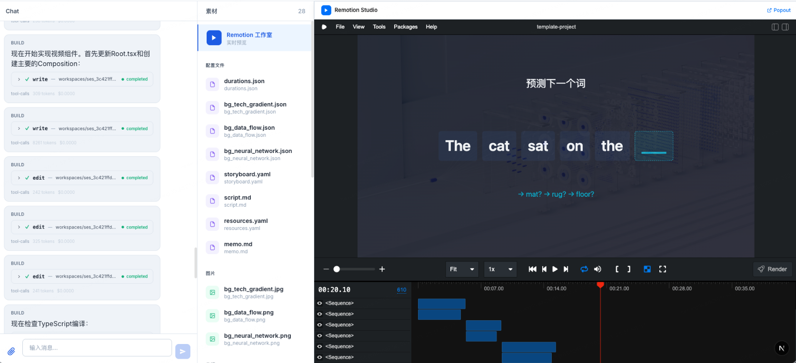

# CaroCut

AI 驱动的视频制作工作流系统，基于 OpenCode AI SDK 和 Remotion 构建。

## 简介

CaroCut 是端到端的自动化视频生产平台。通过多 Agent 协作（orchestrator + planner/media/builder/reviewer），将原始素材（PDF、图片、文本）转化为专业视频。



核心特性：

- **多 Agent 协作**：5 个专业 Agent，12 个 Skill，职责隔离
- **10 步标准工作流**：环境检查 → 素材分析 → 策划 → 脚本润色 → 视觉素材 → 音频素材 → Remotion 初始化 → 资产管道 → 组件实现 → 预览渲染
- **Remotion 驱动**：React 组件编程式生成视频，逐帧精确控制
- **断点续做**：`progress.yaml` 状态持久化，支持中断恢复和增量修改

## 快速开始

### 环境要求

- macOS / Linux（不支持 Windows，需用 WSL2）
- Node.js >= 18, Python >= 3.9, ffmpeg
- API 密钥：PEXELS_API_KEY（必需），PIXABAY_API_KEY / CARO_LLM_API_KEY / FREESOUND_API_KEY（可选）
- Python 包：`pip3 install -r requirements.txt`（含 edge-tts）

### 安装与启动

```bash
git clone <repository-url>
cd carocut/
pnpm install
cp opencode-template.json opencode.json  # 编辑配置 API 密钥和模型
```

启动需要两个终端：

```bash
# 终端 1：启动 OpenCode 后端
opencode serve --port 4096 --cors http://localhost:3000 --print-logs

# 终端 2：启动前端
pnpm dev                                 # 访问 http://localhost:3000
```

### 启动工作流

在 OpenCode 界面输入 `/carocut`，系统自动执行完整视频制作流水线。

## 架构概览

```
用户输入素材 → Orchestrator → Planner / Media / Builder / Reviewer → 最终视频
```

| 阶段 | 步骤 | Agent | 描述 |
|------|------|-------|------|
| Setup | step-0 | planner | 环境检查 |
| Planning | step-1, 2 | planner | 素材分析、制作策划 |
| Enhancement | step-3, 4, 5 | media | 脚本润色、视觉素材、音频素材 |
| Implementation | step-6, 7, 8 | builder | Remotion 初始化、资产管道、组件实现 |
| Delivery | step-9 | reviewer | 预览审查、最终渲染 |

## 项目结构

```
carocut/
├── app/                    # Next.js 应用（页面 + API 路由）
├── components/             # React 组件
├── lib/                    # 工具函数（studio-manager 等）
├── .opencode/
│   ├── agents/             # 5 个 Agent 定义
│   ├── commands/           # /carocut 命令
│   └── skills/             # 12 个 Skill 定义
├── raws/                   # 原始素材（images/ + audio/）
├── workspaces/             # 运行时工作空间
├── server.ts               # Next.js + Remotion Studio 代理服务器
├── opencode-template.json  # OpenCode 配置模板
└── requirements.txt        # Python 依赖
```

## 文档

- **[完整指南](docs/GUIDE.md)** — 环境配置、开发规范、使用方法、素材规范
- **[架构详解](docs/ARCHITECTURE.md)** — 系统架构、Agent 设计、数据流、设计决策
- **[贡献指南](CONTRIBUTING.md)** — 代码规范、PR 流程

## 许可证

MIT License。详见 [LICENSE](./LICENSE)。

**Remotion 许可证**：Remotion 为源码可见项目，个人/非营利/≤3 人公司免费，超 3 人公司商用需购买 [Remotion License](https://remotion.dev/license)。详见 [THIRD-PARTY-NOTICES](./THIRD-PARTY-NOTICES)。

## 致谢

[Remotion](https://remotion.dev) · [OpenCode SDK](https://github.com/anomalyco/opencode) · [Pexels](https://www.pexels.com) · [Pixabay](https://pixabay.com) · [Freesound](https://freesound.org)
